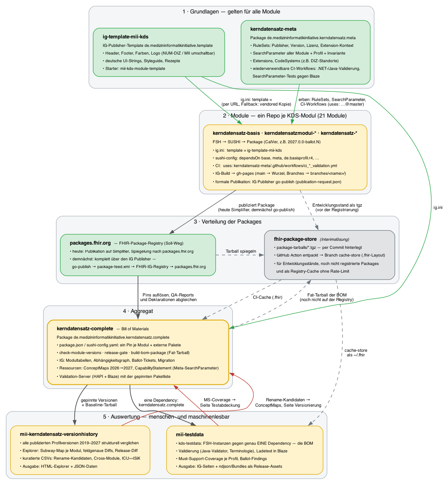

# Entwicklungsstack - MII Kerndatensatz Complete v2027.0.0-ballot.19

* [**Table of Contents**](toc.md)
* **Entwicklungsstack**

## Entwicklungsstack

Der Kerndatensatz entsteht nicht in einem Repository, sondern in einem Verbund aus Repositories mit klar verteilten Rollen. Diese Seite zeigt den **gesamten Stack** von den modulübergreifenden Grundlagen über die Modul-Repositories und die Verteilung der Packages bis zur BOM und ihren Auswertungen — wer was liefert, wer von wem erbt und wo die Ergebnisse menschen- und maschinenlesbar ankommen.

Generiert aus `dev-stack.dot` via Graphviz. Grün = stabile Grundlage bzw. Soll-Weg (Registry), gelb = Ballot-Linie 2027, grau = Interimslösung. Graue gestrichelte Kanten = Interims-Pfade über den Package-Store, rote Kanten = Rückfluss der Auswertungen in diese BOM.

### 1. Grundlagen: Meta und IG-Template

Zwei Repositories liefern das, was **alle** Module gemeinsam haben — die Module schreiben es nicht ab, sondern referenzieren es.

**[kerndatensatz-meta](https://github.com/medizininformatik-initiative/kerndatensatz-meta)** (Package `de.medizininformatikinitiative.kerndatensatz.meta`, [IG](https://medizininformatik-initiative.github.io/kerndatensatz-meta/)) ist die fachlich-technische Grundlage. Es enthält

* die **RuleSets**, die jedes Modul in seine Conformance-Ressourcen einbindet: Publisher und Kontakt, Lizenz (CC-BY-4.0 als Extension), Versionsschema, Extension-Kontext;
* die **SearchParameter** des gesamten Kerndatensatzes an einer Stelle, samt eigenem Profil `mii-pr-meta-searchparameter` und einer Invariante für die Code-Konvention — Module definieren keine eigenen SearchParameter, sie werden hier gepflegt und getestet;
* modulübergreifende **Extensions und CodeSystems** (z.B. die DIZ-Standorte);
* die **wiederverwendbaren CI-Workflows** `ci_dotnet_validation.yml`, `ci_java_validation.yml` und die SearchParameter-Tests gegen einen Blaze-Server. Ein Modul-Repo ruft sie per `uses: medizininformatik-initiative/kerndatensatz-meta/.github/workflows/…` auf; eine Korrektur am Validierungs-Workflow erreicht damit alle Module ohne Änderung in den Modul-Repos.

**[ig-template-mii-kds](https://github.com/medizininformatik-initiative/ig-template-mii-kds)** ([Demo](https://medizininformatik-initiative.github.io/ig-template-mii-kds/)) ist das Darstellungs-Template für den HL7 IG Publisher, aufgesetzt auf `fhir2.base.template`: Header, Footer, Farben und Logo mit zwei umschaltbaren Corporate Designs (NUM-DIZ als Default für die Zeit nach dem MII-Förderende, MII), deutsche UI-Strings für das Basistemplate, Styleguide und Schritt-für-Schritt-Rezepte. Ein Modul nennt es in `ig.ini` — der IG Publisher wendet es beim Build an. Solange das Template-Package nicht auf einer Registry liegt, geschieht das **per GitHub-URL** (Interimsform, Beschluss 2026-08-28) mit einer vendored Kopie als Offline-Fallback. Neue Module starten mit dem Starter-Repo [mii-kds-module-template](https://github.com/medizininformatik-initiative/mii-kds-module-template), das Template und Meta-Workflows bereits referenziert.

### 2. Module: ein Repository je KDS-Modul

Jedes der 21 Module lebt in einem eigenen Repository der [MII-GitHub-Organisation](https://github.com/orgs/medizininformatik-initiative/repositories?q=kerndatensatz) (`kerndatensatz-basis`, `kerndatensatzmodul-*`, `kerndatensatz-*`). Der Ablauf ist überall gleich:

1. **Profilierung in FSH**, Build mit SUSHI;`sushi-config.yaml`deklariert die Abhängigkeiten (`base`,`meta`,`de.basisprofil.r4`, externe Pakete) in exakten Versionen.
1. **Validierung in CI**über die Meta-Workflows (.NET- und Java-Validator, Status-Check der Ressourcen).
1. **IG-Build**mit dem IG Publisher und dem MII-Template;`main`landet auf der Wurzel der GitHub Pages, jeder andere Branch unter`branches/<name>/`— während Ballotierung und Template-Migration tragen diese Branch-Builds den aktuellen Stand.
1. **Release**als Git-Tag nach[CalVer](versionierung.md)(`2027.0.0-ballot.N`), GitHub-Release mit dem Tarball als Asset. Die**formale Publikation**läuft über den IG Publisher:`publication-request.json`beschreibt die Version, der`go-publish`-Workflow baut sie reproduzierbar, validiert, legt die Publikationsstruktur mit`package-list.json`und`package-feed.xml`auf GitHub Pages ab und erzeugt den Patch für die FHIR-IG-Registry — jeder dieser Schritte ist bewusst manuell freizugeben.
1. **Package-Publikation**: heute noch auf**Simplifier**— der Workflow`publish-simplifier`lädt exakt das Package des go-publish-Laufs hoch, damit Registry und Publikation identisch sind. Demnächst entfällt dieser Schritt:`packages.fhir.org`liest das Package direkt aus dem Feed der IG-Publisher-Publikation.

Welche Version je Modul gerade gilt, zeigt die [Gesamtübersicht](index.md#gesamtübersicht); wie weit die Module untereinander konsistent sind, der [Abhängigkeitsgraph](index.md#abhängigkeitsgraph).

### 3. Verteilung: Registry und fhir-package-store

Der **Soll-Weg** ist die FHIR-Package-Registry `packages.fhir.org`: Jeder Konsument — Module, diese BOM, Standorte — löst die Packages mit SUSHI oder Firely Terminal von dort auf. Wie ein Package dorthin kommt, ist gerade im Übergang:

* **Heute** publiziert ein Modul sein Package im Simplifier-Projekt [MedizininformatikInitiative-Kerndatensatz](https://simplifier.net/organization/koordinationsstellemii/~packages); von dort wird es nach `packages.fhir.org` gespiegelt.
* **Demnächst** läuft die Publikation komplett über den IG Publisher: Die go-publish-Publikation auf GitHub Pages führt `package-feed.xml`, die FHIR-IG-Registry kennt den Feed, und `packages.fhir.org` übernimmt das Package daraus. Simplifier ist dann kein Publikationsschritt mehr.

Daneben gibt es, **ausdrücklich als Interimslösung**, den [fhir-package-store](https://github.com/medizininformatik-initiative/fhir-package-store). Er ist ein per Commit gepflegter Ablageort: Tarballs werden in `package-tarballs/` eingecheckt, eine GitHub Action entpackt sie in das `.fhir`-Layout und schreibt das Ergebnis in den Branch `cache-store`. Ein CI-Workflow checkt diesen Branch als `~/.fhir` aus und hat damit alle Packages, ohne die Registry anzufragen. Das löst drei Probleme der Entwicklungsphase:

* **Entwicklungsstände** lassen sich ablegen und gegen sie bauen, bevor ein Package registriert ist (Ballot-RCs, Branch-Builds, Snapshots);
* das **Fat-Package dieser BOM** ist noch auf keiner Registry — die Testdaten beziehen es ausschließlich von dort;
* die Registry-**Rate-Limits** treffen die CI-Läufe nicht.

Der Store ist kein Ersatz für die Registry und soll mit der Publikation der Packages auf `packages.fhir.org` entfallen. Bekannte Einschränkung: Der Cache-Workflow zerlegt Name und Version am letzten Bindestrich und kommt mit Prerelease-Versionen wie `2027.0.0-ballot.19` nicht zurecht ([PR #15](https://github.com/medizininformatik-initiative/fhir-package-store/pull/15)); die Testdaten-CI zieht das BOM-Tarball deshalb direkt aus `main` und entpackt es selbst.

### 4. Aggregat: kerndatensatz-complete

Dieses Repository zieht alles zusammen. Es enthält keine eigenen Profile, sondern **einen Pin je Modul und je externem Paket** — in sechs Quellen, die übereinstimmen müssen (`package.json`, `sushi-config.yaml`, HAPI- und Blaze-Konfiguration, Dockerfile des Validation-Servers, Modultabelle). Skripte sichern das ab: `check-module-versions.py` prüft Konsistenz und Registry, `release-gate.sh` bündelt Konsistenz, QA-Reports der Module, Build und Dateinamen-Kollisionen zu einem Release-Urteil, `build-bom-package.sh` baut das Fat-Package, das die Conformance-Ressourcen und Beispiele aller Module physisch einbettet.

Der IG dieser BOM ist die **menschenlesbare Sicht** auf den Stand des gesamten Kerndatensatzes: Modultabellen mit Package, IG-Build und QA-Stand, der Abhängigkeitsgraph, der [Ballot-Ticketstand](ballot.md), die [Versionierung](versionierung.md) mit den Profil-Übergängen und der [Migrationsleitfaden](migration.md). Daneben liefert das Package maschinenlesbare Ressourcen, die es nur auf dieser Ebene geben kann: die **ConceptMaps** für die Canonical-Migration 2026→2027 (Profile, ValueSets, ICU↔ISiK-Governance), per `$translate` auf jedem Terminologie-Server abfragbar, und ein aggregiertes **CapabilityStatement**, das die CapabilityStatements der Module mit den SearchParametern aus Meta zu einer Anforderung an einen KDS-Server zusammenführt. Die Konfiguration des [Validation-Servers](https://github.com/medizininformatik-initiative/kerndatensatz-complete/tree/main/validation-server) (HAPI und Blaze) trägt dieselbe Paketliste.

### 5. Auswertung: Testdaten und Version-History

Zwei Repositories konsumieren die BOM und spielen ihre Ergebnisse hierher zurück.

**[mii-testdata](https://github.com/medizininformatik-initiative/mii-testdata)** ([IG](https://medizininformatik-initiative.github.io/mii-testdata/)) baut die technischen Modul-Instanzen und die klinisch plausiblen Patienten-Bundles gegen **genau eine Dependency** — das Complete-Package in der gepinnten Version. Damit ist jeder Testdaten-Stand eindeutig einem BOM-Stand zugeordnet. Die CI validiert mit dem Java-Validator und gegen Terminologie-Server, lädt die Daten in Blaze und misst die **Must-Support-Coverage** je Profil. Ergebnisse: die Testdaten selbst als ndjson und Bundles in den [Release-Assets](https://github.com/medizininformatik-initiative/mii-testdata/releases), die Coverage- und Ballot-Findings-Seiten im Testdaten-IG und — als Rückfluss — die Seite [Testabdeckung](testabdeckung.md) dieser BOM, die strenger rechnet, weil alle Profile der BOM in den Nenner eingehen.

**[mii-kerndatensatz-versionhistory](https://github.com/medizininformatik-initiative/mii-kerndatensatz-versionhistory)** ([Explorer](https://medizininformatik-initiative.github.io/mii-kerndatensatz-versionhistory/)) vergleicht alle publizierten Profilversionen seit 2019 strukturell. Die 2027er Ballot-Linie ist darin über die Pins dieser BOM definiert, der Release-Diff nimmt das letzte stabile BOM-Tarball als Baseline. Ergebnisse: der Explorer mit Subway-Map je Modul und feldgenauen Diffs, die JSON-Daten dahinter und die kuratierten CSV-Listen (Rename-Kandidaten, modulübergreifende Zusammenführungen, ICU↔ISiK-Governance). Der Rückfluss in die BOM ist zweifach: Die Tabelle der Profil-Übergänge auf der Seite [Versionierung](versionierung.md) wird daraus generiert, und bestätigte Umbenennungen werden zu `equivalent`-Einträgen in den Migrations-ConceptMaps.

### Menschen- und maschinenlesbar

Jede Ebene des Stacks hat beide Ausgaben. Die Tabelle zeigt, wo was ankommt:

| | | |
| :--- | :--- | :--- |
| Modulübergreifende Vorgaben | [Meta-IG](https://medizininformatik-initiative.github.io/kerndatensatz-meta/),[Meta-Wiki](https://github.com/medizininformatik-initiative/kerndatensatz-meta/wiki) | Package`…kerndatensatz.meta`: RuleSets, SearchParameter, Extensions |
| Darstellung der Guides | [Template-Demo](https://medizininformatik-initiative.github.io/ig-template-mii-kds/), Styleguide | Template-Package`de.medizininformatikinitiative.template` |
| Ein Modul | Modul-IG auf GitHub Pages (go-publish-Publikation) | Modul-Package auf`packages.fhir.org`(heute über Simplifier, demnächst aus dem Package-Feed der IG-Publikation) |
| Der gesamte Kerndatensatz | dieser IG:[Gesamtübersicht](index.md#gesamtübersicht), Abhängigkeitsgraph,[Ballot](ballot.md) | `package.json`der BOM, Fat-Package, ImplementationGuide-Ressource |
| Umstieg 2026 → 2027 | [Migration](migration.md),[Versionierung](versionierung.md) | ConceptMaps (`$translate`), Rename-CSVs der Version-History |
| Suchanforderungen an Server | Meta-IG,[Artefakte](artifacts.md) | aggregiertes CapabilityStatement + SearchParameter |
| Testdaten | [Testabdeckung](testabdeckung.md), Testdaten-IG | ndjson/Bundles in den Release-Assets |
| Versionsgeschichte | [Version-History-Explorer](https://medizininformatik-initiative.github.io/mii-kerndatensatz-versionhistory/) | JSON-Daten und CSVs im Repository |

### Was sich noch ändert

* Der **fhir-package-store** ist eine Übergangslösung und entfällt, sobald alle Packages — auch das Complete-Package — auf `packages.fhir.org` liegen.
* Die **Package-Publikation** wechselt von Simplifier auf die IG-Publisher-Publikation (`go-publish`, Package-Feed, FHIR-IG-Registry); bis dahin wird das go-publish-Package zusätzlich nach Simplifier hochgeladen.
* Das **IG-Template** wird per URL referenziert, bis das Template-Package registriert ist; dann steht in `ig.ini` ein Package-Name mit Version.
* Die **Version-History** ist in Kuratierung; Rename- und Cross-Module-Kandidaten brauchen Fachurteile, bevor sie verbindlich in die ConceptMaps einfließen.
* Noch nicht alle Module sind auf das MII-Template umgezogen; den Migrationsstand je Modul führt die Taskforce Kerndatensatz.

