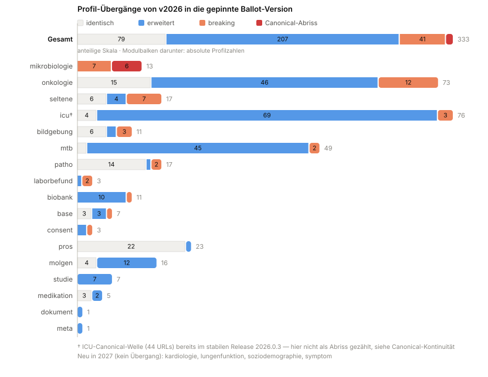

# Migration - MII Kerndatensatz Complete v2027.0.0-ballot.19

* [**Table of Contents**](toc.md)
* **Migration**

## Migration

# Migration von v2026

Leitfaden für Standorte und Projekte, die von der 2026er KDS-Linie auf die **2027er Ballot-Linie** dieser BOM wechseln. Die zugrunde liegenden Zahlen und der Profil-für-Profil-Vergleich stehen auf der Seite [Versionierung](versionierung.md); hier steht, **was zu tun ist**.

Generiert mit `scripts/migration-viz.py`. Grau = kein Handlungsbedarf, Blau = nur Erweiterungen, Orange = breaking, Rot = Canonical-Abriss. Sortiert nach Handlungsbedarf.

### 1. Dependency umstellen

Eine Abhängigkeit statt 21: die BOM pinnt alle Module und die externen Pakete in geprüft kompatiblen Versionen (siehe [Installation](index.md#installation)). Beim Wechsel von einzeln deklarierten 2026er-Modulen die Einzeldeklarationen **entfernen** — sonst entstehen doppelte Canonicals beim Auflösen.

Die 2027er Linie ist untereinander kohärent: Base und Meta werden nur noch in je einer Version gezogen, die Validierungsprobleme durch doppelte Canonicals der frühen Ballot-Phase entfallen.

### 2. Canonical-Umbenennungen migrieren (wichtigster Schritt)

Einige Module haben Profil-URLs umbenannt — Instanzen mit `meta.profile` auf die alten Canonicals validieren dann gegen nichts mehr:

* **ICU**: die große Welle (nur 25 von 69 URLs bleiben) geschah **schon im stabilen Release `2026.0.2 → 2026.0.3`**. Wer von `2026.0.2` oder älter kommt, muss die Canonicals unabhängig vom Ballot migrieren; `2027.0.0-ballot.3` führt die neuen URLs unverändert weiter.
* **Mikrobiologie**: 6 Umbenennungen an der Ballot-Grenze.
* **Molekulargenetik**: 4 Umbenennungen.

Die kuratierte Zuordnung alt → neu entsteht in der [Rename-Kandidatenliste](https://github.com/medizininformatik-initiative/mii-kerndatensatz-versionhistory/blob/main/data/rename-candidates-2027.csv) (Ähnlichkeits-Matching über Element-Fingerprints; Spalte `confirmed` zeigt den Kuratierungsstand). Für ETL-Strecken heißt das: `meta.profile`-Werte per Mapping-Tabelle ersetzen, Profil-basierte Routing-/Validierungsregeln anpassen.

### 3. Breaking-Änderungen prüfen

41 Profil-Übergänge sind strukturell breaking (Elemente entfernt oder inkompatibel geändert) — Schwerpunkte **Onkologie (12)**, Mikrobiologie (7), Seltene Erkrankungen (7), Bildgebung (3), ICU (3). Welche Elemente konkret, zeigt der [Version-History-Explorer](https://medizininformatik-initiative.github.io/mii-kerndatensatz-versionhistory/) je Profil (bzw. `profile-pairwise-changes.csv` im selben Repo, Spalten `elements_removed`/`elements_added`).

Die Mehrheit der Übergänge ist unkritisch: 79 Profile identisch, 200 nur erweitert — bestehende Instanzen bleiben dort gültig.

#### Breaking-Änderungen im Detail

41 Breaking-Übergänge · Stand: 2026-09-23 · generiert mit `scripts/version-transitions.py` 

### 4. Externe Abhängigkeiten anheben

| | | |
| :--- | :--- | :--- |
| `de.basisprofil.r4` | 1.5.x / 1.6.0, teils Tippfehler | einheitlich**1.6.0** |
| `de.gematik.isik` | 5.1.x / 6.0.0 | **6.0.0**(nur Patho noch 5.1.2) |
| `hl7.terminology.r4` | 5.0.0 – 7.2.0 | **7.3.0**(Nachzügler 7.1.0) |
| `hl7.fhir.uv.extensions.r4` | 5.1.0 / 5.2.0 | **5.3.0**(Nachzügler 5.2.0) |
| `eu.miabis.r4` | 0.2.0 | **1.3.0**— neue MIABIS-Pfade ohne`/fhir/`-Segment |

Lokale Ableitungen von diesen Paketen (eigene Profile auf ISiK-/Basisprofil-Basis) auf die neuen Versionen heben.

### 5. Neue Module einplanen

**Kardiologie, Lungenfunktion, Soziodemographie und Symptome** sind neu in der BOM — rein additiv, kein Migrationsaufwand, aber ggf. neue Datenquellen für das DIZ-Mapping.

### 6. Validieren

Der [Validation-Server](https://github.com/medizininformatik-initiative/kerndatensatz-complete/tree/main/validation-server) der BOM (HAPI + Blaze, vorkonfiguriert mit allen Pins) eignet sich als Migrations-Prüfstand: 2026er Bestandsinstanzen dagegen validieren zeigt Renames (Profil unbekannt) und Breaking-Änderungen (Validierungsfehler) unmittelbar. Testdaten zum Vergleich liefert [mii-testdata](https://github.com/medizininformatik-initiative/mii-testdata); den Abdeckungsstand zeigt die Seite [Testabdeckung](testabdeckung.md).

> **Status**: Die 2027er Linie ist ein Ballot-Arbeitsstand. Produktive Migrationen sollten auf das finale 2027-Release warten — dieser Leitfaden dient der Aufwandsabschätzung und der Ballot-Prüfung.

