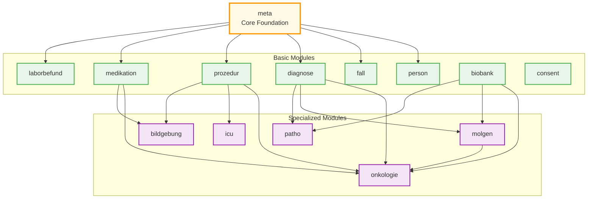
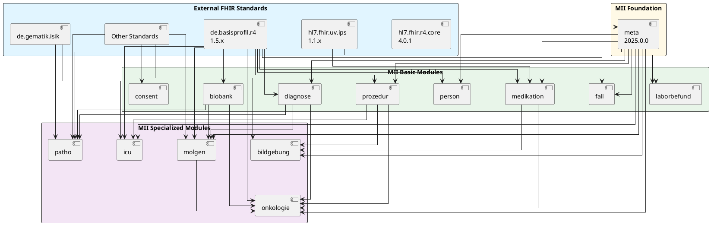

# MII Kerndatensatz Module Dependencies

This document visualizes the package dependencies between MII modules based on actual package.json files from version 2025.0.x.

## Complete Dependency Graph

```mermaid
graph TD
    %% External Dependencies
    FHIR[hl7.fhir.r4.core<br/>4.0.1]
    DEBase[de.basisprofil.r4<br/>1.5.x]
    IPS[hl7.fhir.uv.ips<br/>1.1.x]
    Einwilligung[de.einwilligungsmanagement<br/>1.0.1]
    ISIKVital[de.gematik.isik-vitalparameter<br/>4.0.0]
    ISIKBasis[de.gematik.isik-basismodul<br/>4.0.0]
    IHETerm[de.ihe-d.terminology<br/>3.0.1]
    GenomicsReporting[hl7.fhir.uv.genomics-reporting<br/>2.0.0]
    mCODE[hl7.fhir.us.mcode<br/>2.1.0]
    DICOM[fhir.dicom<br/>2024.2]
    HL7Term[hl7.terminology.r4<br/>6.1.0]

    %% MII Core Foundation
    meta[meta<br/>2025.0.0]

    %% MII Basic Modules
    person[person<br/>2025.0.0]
    fall[fall<br/>2025.0.0]
    diagnose[diagnose<br/>2025.0.0]
    prozedur[prozedur<br/>2025.0.0]
    medikation[medikation<br/>2025.0.0]
    labor[laborbefund<br/>2025.0.1]
    biobank[biobank<br/>2025.0.0]
    consent[consent<br/>2025.0.0]

    %% MII Specialized Modules
    onko[onkologie<br/>2025.0.0]
    icu[icu<br/>2025.0.0]
    molgen[molgen<br/>2025.0.0]
    patho[patho<br/>2025.0.2]
    bildgebung[bildgebung<br/>2025.0.0]

    %% External Base Dependencies
    FHIR --> meta
    FHIR --> biobank
    FHIR --> consent

    DEBase --> person
    DEBase --> fall
    DEBase --> diagnose
    DEBase --> prozedur
    DEBase --> medikation
    DEBase --> biobank
    DEBase --> onko
    DEBase --> icu
    DEBase --> molgen

    %% Meta Dependencies
    meta --> person
    meta --> fall
    meta --> diagnose
    meta --> prozedur
    meta --> medikation
    meta --> labor
    meta --> onko
    meta --> molgen
    meta --> patho
    meta --> bildgebung

    %% IPS Dependencies
    IPS --> labor
    IPS --> medikation

    %% Other External Dependencies
    Einwilligung --> consent
    IHETerm --> medikation
    ISIKVital --> icu
    ISIKBasis --> patho
    GenomicsReporting --> molgen
    HL7Term --> molgen
    mCODE --> patho
    DICOM --> bildgebung

    %% Inter-Module Dependencies (MII modules depending on other MII modules)
    diagnose --> onko
    diagnose --> molgen
    diagnose --> patho

    prozedur --> onko
    prozedur --> icu
    prozedur --> bildgebung

    biobank --> onko
    biobank --> molgen
    biobank --> patho

    medikation --> onko
    medikation --> bildgebung

    molgen --> onko

    %% Styling
    classDef external fill:#e1f5ff,stroke:#0066cc,stroke-width:2px
    classDef foundation fill:#fff9e6,stroke:#ff9800,stroke-width:3px
    classDef basic fill:#e8f5e9,stroke:#4caf50,stroke-width:2px
    classDef specialized fill:#f3e5f5,stroke:#9c27b0,stroke-width:2px

    class FHIR,DEBase,IPS,Einwilligung,ISIKVital,ISIKBasis,IHETerm,GenomicsReporting,mCODE,DICOM,HL7Term external
    class meta foundation
    class person,fall,diagnose,prozedur,medikation,labor,biobank,consent basic
    class onko,icu,molgen,patho,bildgebung specialized
```



## Legend

- **Yellow (Foundation)**: Core meta module - shared types and extensions
- **Green (Basic Modules)**: Core clinical data modules
- **Purple (Specialized Modules)**: Domain-specific extension modules
- **Blue (External)**: External FHIR packages (HL7, German profiles, etc.)

## Dependency Layers

### Layer 0: External Foundation
- `hl7.fhir.r4.core` (FHIR R4)
- `de.basisprofil.r4` (German Base Profiles)
- Other external standards (IPS, ISIK, genomics, etc.)

### Layer 1: MII Foundation
- **meta** - Only depends on FHIR core
  - Provides: Common data types, extensions, naming systems, code systems used across all modules

### Layer 2: MII Basic Modules
Independent modules that depend only on external packages and meta:

- **person** → meta, de.basisprofil.r4
- **fall** (Encounter) → meta, de.basisprofil.r4
- **diagnose** (Condition) → meta, de.basisprofil.r4
- **prozedur** (Procedure) → meta, de.basisprofil.r4
- **medikation** (Medication) → meta, de.basisprofil.r4, hl7.fhir.uv.ips, de.ihe-d.terminology
- **laborbefund** (Laboratory) → meta, hl7.fhir.uv.ips
- **biobank** → de.basisprofil.r4 ⚠️ *Note: Does not depend on meta!*
- **consent** → de.einwilligungsmanagement

### Layer 3: MII Specialized Modules
Complex modules with inter-module dependencies:

- **onkologie** (Oncology)
  - Depends on: meta, diagnose, prozedur, biobank, medikation, molgen, de.basisprofil.r4
  - Most complex module with 7 dependencies including another specialized module (molgen)

- **molgen** (Molecular Genetics)
  - Depends on: meta, biobank, diagnose, de.basisprofil.r4, hl7.fhir.uv.genomics-reporting, hl7.terminology.r4
  - Required by onkologie

- **patho** (Pathology)
  - Depends on: meta, diagnose, biobank, de.gematik.isik-basismodul, hl7.fhir.us.mcode
  - Uses mCODE for cancer reporting

- **icu** (Intensive Care)
  - Depends on: meta, prozedur, de.basisprofil.r4, de.gematik.isik-vitalparameter
  - ⚠️ *Note: Still references old meta 1.0.3 and prozedur 2024.0.0-ballot*

- **bildgebung** (Imaging)
  - Depends on: meta, prozedur, medikation, fhir.dicom
  - Integrates DICOM standard

## Simplified Module-Only View



## Dependency Matrix

| Module | External | meta | Basic Modules | Specialized Modules |
|--------|----------|------|---------------|---------------------|
| **meta** | FHIR | - | - | - |
| **person** | DE Base | ✓ | - | - |
| **fall** | DE Base | ✓ | - | - |
| **diagnose** | DE Base | ✓ | - | - |
| **prozedur** | DE Base | ✓ | - | - |
| **medikation** | DE Base, IPS, IHE-D | ✓ | - | - |
| **laborbefund** | IPS | ✓ | - | - |
| **biobank** | DE Base | - | - | - |
| **consent** | Einwilligung | - | - | - |
| **onkologie** | DE Base | ✓ | diagnose, prozedur, biobank, medikation | molgen |
| **icu** | DE Base, ISIK-Vital | ✓ | prozedur | - |
| **molgen** | DE Base, Genomics, HL7 Term | ✓ | diagnose, biobank | - |
| **patho** | ISIK-Basis, mCODE | ✓ | diagnose, biobank | - |
| **bildgebung** | DICOM | ✓ | prozedur, medikation | - |

## Key Insights

1. **meta is the core foundation** - Used by almost all modules (except biobank and consent)

2. **Most reused modules**:
   - **diagnose**: Referenced by onkologie, molgen, patho (3 modules)
   - **prozedur**: Referenced by onkologie, icu, bildgebung (3 modules)
   - **biobank**: Referenced by onkologie, molgen, patho (3 modules)

3. **Standalone modules**:
   - **biobank** (only external deps)
   - **consent** (only external deps)

4. **Most complex module**:
   - **onkologie** with 7 dependencies including another specialized module

5. **Version inconsistencies**:
   - icu still uses meta 1.0.3 and prozedur 2024.0.0-ballot
   - biobank version varies: onkologie uses 2025.0.2, others use different versions

## PlantUML Alternative

For more detailed visualization with better layout control:



## Usage

### Viewing Mermaid Diagrams
- GitHub/GitLab: Renders automatically
- VS Code: Install "Markdown Preview Mermaid Support" extension
- Online: https://mermaid.live/

### Viewing PlantUML Diagrams
- Online: http://www.plantuml.com/plantuml/
- VS Code: Install "PlantUML" extension
- CLI: `plantuml module-dependencies.md`

### Generating From Local Packages
```bash
# Extract all dependencies
for pkg in ~/.fhir/packages/de.medizininformatikinitiative.kerndatensatz.*#2025.*/package/package.json; do
  echo "$(dirname $(dirname $pkg)):"
  jq -r '.name + " " + .version + " depends on: " + (.dependencies | keys | join(", "))' "$pkg"
done
```
