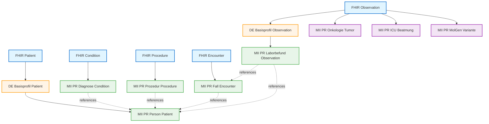
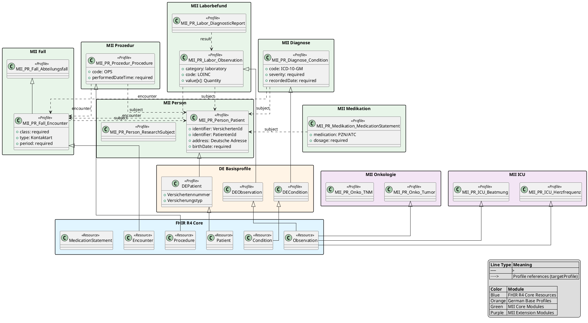
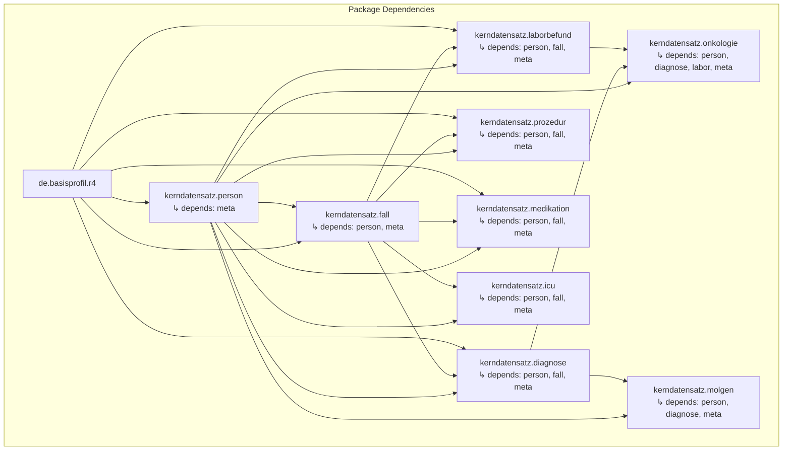

# MII Profile Dependency Visualization

This document shows different approaches to visualizing FHIR profile dependencies in the MII Kerndatensatz.

## Approach 1: Mermaid Diagram (Markdown-friendly)

Mermaid diagrams work in GitHub, GitLab, and many markdown viewers.

**Legend:**
- Solid arrows (→): Profile inheritance (Parent/BaseDefinition)
- Dotted arrows (-.->): Profile references (element.type.targetProfile)
- Colors:
  - Blue: Base FHIR resources
  - Orange: German base profiles
  - Green: MII core profiles
  - Purple: MII specialized profiles

## Approach 2: PlantUML Diagram (More detailed)

PlantUML offers more layout control and can show additional metadata.

## Approach 3: Hierarchical Package View

## Usage

### Rendering Mermaid
Mermaid diagrams render automatically in:
- GitHub README/markdown files
- GitLab
- VS Code (with Mermaid extension)
- Many documentation tools

### Rendering PlantUML
PlantUML requires additional tools:
- Online: http://www.plantuml.com/plantuml/
- VS Code: PlantUML extension
- CLI: `plantuml diagram.puml`
- IntelliJ IDEA: Built-in support

### Interactive Navigation
See `profile-navigator.html` for an interactive web-based profile browser.

## Next Steps

1. **Extract actual profile data**: Run the profile extraction script to get real data from packages
2. **Generate visualization**: Use the extracted data to auto-generate diagrams
3. **Explore in UI**: Use the profile navigator to interactively explore relationships
