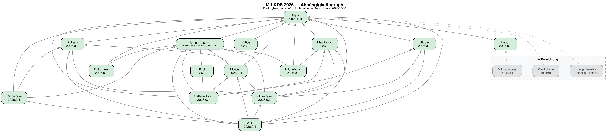

# Home - MII Kerndatensatz Complete v2026.0.1-rc.1

* [**Table of Contents**](toc.md)
* **Home**

## Home

| | |
| :--- | :--- |
| *Official URL*:https://www.medizininformatik-initiative.de/fhir/core/complete/ImplementationGuide/de.medizininformatikinitiative.kerndatensatz.complete | *Version*:2026.0.1-rc.1 |
| Active as of 2026-09-21 | *Computable Name*:MIIKerndatensatzComplete |

# MII Kerndatensatz Complete

Dieses Paket ist die **Bill of Materials (BOM)** des MII Kerndatensatzes — eine kuratierte Zusammenstellung aller KDS-Module mit ihren kompatiblen Versionen. Es enthält keine eigenen Profile, sondern definiert, welche Modulversionen zusammen getestet und freigegeben wurden.

### Warum eine BOM?

Die Module des Kerndatensatzes werden von verschiedenen Teams eigenständig weiterentwickelt und versioniert. Änderungen an einem Modul können Auswirkungen auf abhängige Module haben und müssen konsistent nach unten propagiert werden. Die BOM löst drei zentrale Herausforderungen:

1. **Konsistenz**: Sie stellt sicher, dass alle Modulversionen zueinander kompatibel sind und Änderungen in Abhängigkeiten berücksichtigt wurden.
1. **Verbindlichkeit**: Standorte und Projekte können sich auf einen definierten, geprüften Versionsstand des gesamten Kerndatensatzes beziehen.
1. **Flexibilität**: Modulteams können unabhängig weiterentwickeln und neue Versionen veröffentlichen. Standorte können bei Bedarf einzelne Module in neueren Versionen nutzen — etwa für projektspezifische Anforderungen — ohne auf ein neues BOM-Release warten zu müssen.

Während das [Meta-Modul](https://github.com/medizininformatik-initiative/kerndatensatz-meta) (`de.medizininformatikinitiative.kerndatensatz.meta`) modulübergreifende Ressourcen bereitstellt, die von den einzelnen KDS-Modulen als Grundlage genutzt werden (Extensions, CodeSystems, Naming-Conventions), dient dieses Complete-Paket als gebündelter Output: Eine einzelne Abhängigkeit, die alle Module des Kerndatensatzes in ein Projekt einbindet.

## Abhängigkeitsgraph



## Module

> Die Einteilung in Basis- und Erweiterungsmodule folgt der bisherigen Konvention des Kerndatensatzes. Diese Kategorisierung spiegelt jedoch nicht den aktuellen Reifegrad, die Verbreitung oder den Innovationscharakter der einzelnen Module wider. Wir arbeiten derzeit an einer differenzierteren Klassifikation, die den dynamischen Entwicklungen im MII-Ökosystem besser gerecht wird.

### Basismodule

| | | | | |
| :--- | :--- | :--- | :--- | :--- |
| Base (Person, Fall, Diagnose, Prozedur, Consent) | `de.medizininformatikinitiative.kerndatensatz.base` | 2026.0.0 | [kerndatensatz-basis](https://github.com/medizininformatik-initiative/kerndatensatz-basis) | [v2026.0.0](https://github.com/medizininformatik-initiative/kerndatensatz-basis/releases/tag/v2026.0.0)(2025-12-13) |
| Meta | `de.medizininformatikinitiative.kerndatensatz.meta` | 2026.0.0 | [kerndatensatz-meta](https://github.com/medizininformatik-initiative/kerndatensatz-meta) | [v2026.0.0](https://github.com/medizininformatik-initiative/kerndatensatz-meta/releases/tag/v2026.0.0)(2025-11-24) |
| Medikation | `de.medizininformatikinitiative.kerndatensatz.medikation` | 2026.0.1 | [kerndatensatzmodul-medikation](https://github.com/medizininformatik-initiative/kerndatensatzmodul-medikation) | [v2026.0.1](https://github.com/medizininformatik-initiative/kerndatensatzmodul-medikation/releases/tag/v2026.0.1)(2026-02-13) |
| Laborbefund | `de.medizininformatikinitiative.kerndatensatz.laborbefund` | 2026.0.1 | [kerndatensatzmodul-labor](https://github.com/medizininformatik-initiative/kerndatensatzmodul-labor) | [2026.0.1](https://github.com/medizininformatik-initiative/kerndatensatzmodul-labor/releases/tag/2026.0.1) |

### Erweiterungsmodule

| | | | | |
| :--- | :--- | :--- | :--- | :--- |
| Biobank | `de.medizininformatikinitiative.kerndatensatz.biobank` | 2026.0.1 | [kerndatensatzmodul-biobank](https://github.com/medizininformatik-initiative/kerndatensatzmodul-biobank) | [v2026.0.1](https://github.com/medizininformatik-initiative/kerndatensatzmodul-biobank/releases/tag/v2026.0.1)(2026-02-11) |
| ICU | `de.medizininformatikinitiative.kerndatensatz.icu` | 2026.0.2 | [kerndatensatzmodul-intensivmedizin](https://github.com/medizininformatik-initiative/kerndatensatzmodul-intensivmedizin) | [v2026.0.2](https://github.com/medizininformatik-initiative/kerndatensatzmodul-intensivmedizin/releases/tag/v2026.0.2)(2026-03-18) |
| Mikrobiologie | `de.medizininformatikinitiative.kerndatensatz.mikrobiologie` | 2025.0.1 | [kerndatensatzmodul-mikrobiologie](https://github.com/medizininformatik-initiative/kerndatensatzmodul-mikrobiologie) | - |
| Molekulargenetik | `de.medizininformatikinitiative.kerndatensatz.molgen` | 2026.0.4 | [kerndatensatzmodul-GenetischeTests](https://github.com/medizininformatik-initiative/kerndatensatzmodul-GenetischeTests) | [v2026.0.4](https://github.com/medizininformatik-initiative/kerndatensatzmodul-GenetischeTests/releases/tag/v2026.0.4)(2026-01-02) |
| Pathologie | `de.medizininformatikinitiative.kerndatensatz.patho` | 2026.0.1 | [kerndatensatzmodul-PathologieBefund](https://github.com/medizininformatik-initiative/kerndatensatzmodul-PathologieBefund) | - |
| Studie | `de.medizininformatikinitiative.kerndatensatz.studie` | 2026.0.2 | [kerndatensatzmodul-studie](https://github.com/medizininformatik-initiative/kerndatensatzmodul-studie) | [v2026.0.1](https://github.com/medizininformatik-initiative/kerndatensatzmodul-studie/releases/tag/v2026.0.1)(2026-01-09) |
| Bildgebung | `de.medizininformatikinitiative.kerndatensatz.bildgebung` | 2026.0.0 | [kerndatensatz-bildgebung](https://github.com/medizininformatik-initiative/kerndatensatz-bildgebung) | [v2026.0.0](https://github.com/medizininformatik-initiative/kerndatensatz-bildgebung/releases/tag/v2026.0.0)(2025-12-19) |
| Dokument | `de.medizininformatikinitiative.kerndatensatz.dokument` | 2026.0.1 | [kerndatensatz-dokument](https://github.com/medizininformatik-initiative/kerndatensatz-dokument) | [v2026.0.1](https://github.com/medizininformatik-initiative/kerndatensatz-dokument/releases/tag/v2026.0.1) |
| Onkologie | `de.medizininformatikinitiative.kerndatensatz.onkologie` | 2026.0.3 | [kerndatensatzmodul-onkologie](https://github.com/medizininformatik-initiative/kerndatensatzmodul-onkologie) | [v2026.0.3](https://github.com/medizininformatik-initiative/kerndatensatzmodul-onkologie/releases/tag/v2026.0.3)(2026-03-29) |
| Seltene Erkrankungen | `de.medizininformatikinitiative.kerndatensatz.seltene` | 2026.0.1 | [kerndatensatzmodul-seltene-erkrankungen](https://github.com/medizininformatik-initiative/kerndatensatzmodul-seltene-erkrankungen) | [v2026.0.1](https://github.com/medizininformatik-initiative/kerndatensatzmodul-seltene-erkrankungen/releases/tag/v2026.0.1) |
| Molekulares Tumorboard | `de.medizininformatikinitiative.kerndatensatz.mtb` | 2026.0.1 | [kerndatensatzmodul-molekulares-tumorboard](https://github.com/medizininformatik-initiative/kerndatensatzmodul-molekulares-tumorboard) | [v2026.0.1](https://github.com/medizininformatik-initiative/kerndatensatzmodul-molekulares-tumorboard/releases/tag/v2026.0.1)(2026-03-30) |
| PROs | `de.medizininformatikinitiative.kerndatensatz.pros` | 2026.2.0 | [kerndatensatzmodul-proms](https://github.com/medizininformatik-initiative/kerndatensatzmodul-proms) | [v2026.2.0](https://github.com/medizininformatik-initiative/kerndatensatzmodul-proms/releases/tag/v2026.2.0) |
| Consent | `de.medizininformatikinitiative.kerndatensatz.consent` | 2026.0.1-rc-2 | [kerndatensatzmodul-consent](https://github.com/medizininformatik-initiative/kerndatensatzmodul-consent) | - |

### Nationale Abhängigkeiten

| | | |
| :--- | :--- | :--- |
| Deutsche Basisprofile R4 (`de.basisprofil.r4`) | 1.5.4 | Base, Medikation, Biobank, ICU, Molgen, Onkologie, Seltene, MTB |
| Einwilligungsmanagement (`de.einwilligungsmanagement`) | 2.0.3 | Consent (transitiv) |
| ISiK (`de.gematik.isik`) | 5.0.0 - 5.1.0 | ICU, Pathologie, PROs |
| IHE-D Terminologie (`de.ihe-d.terminology`) | 3.0.1 | Medikation, Dokument |
| Deutsche Medikation (`de.fhir.medication`) | 1.0.x | Medikation |
| DVMD KDL (`dvmd.kdl.r4`) | 2025.0.1 | Dokument |

### Internationale Abhängigkeiten

| | | |
| :--- | :--- | :--- |
| HL7 International Patient Summary (`hl7.fhir.uv.ips`) | 2.0.0 | Medikation, Laborbefund |
| HL7 Genomics Reporting (`hl7.fhir.uv.genomics-reporting`) | 3.0.x | Molekulargenetik, MTB |
| HL7 Structured Data Capture (`hl7.fhir.uv.sdc`) | 3.0.0 | PROs |
| HL7 mCODE (`hl7.fhir.us.mcode`) | 2.1.x | Pathologie |
| MIABIS (`eu.miabis.r4`) | 0.2.0 | Biobank |
| DICOM (`fhir.dicom`) | 2025.3.20250714 | Bildgebung |
| IHE FormatCode (`ihe.formatcode.fhir`) | 1.4.0 | Dokument |

## Installation

### Über die FHIR Package Registry (empfohlen)

Sobald das Paket auf packages.fhir.org verfügbar ist, genügt eine einzelne Abhängigkeit in der `sushi-config.yaml`:

```
dependencies:
  de.medizininformatikinitiative.kerndatensatz.complete: 2026.0.1-rc.1

```

Alle 19 Modul-Dependencies werden automatisch von der FHIR Package Registry aufgelöst und heruntergeladen.

### Manuelle Installation

Solange das Paket noch nicht auf packages.fhir.org verfügbar ist, kann es vom [GitHub Release](https://github.com/medizininformatik-initiative/kerndatensatz-complete/releases/tag/v2026.0.1-rc.1) heruntergeladen und lokal installiert werden:

```
# Package herunterladen
curl -LO https://github.com/medizininformatik-initiative/kerndatensatz-complete/releases/download/v2026.0.1-rc.1/de.medizininformatikinitiative.kerndatensatz.complete-2026.0.1-rc.1.tgz

# In den lokalen FHIR-Cache installieren
fhir install de.medizininformatikinitiative.kerndatensatz.complete-2026.0.1-rc.1.tgz

```

Danach kann das Paket wie gewohnt als Dependency referenziert werden. Alle weiteren Module werden automatisch von packages.fhir.org aufgelöst.

> **Hinweis:** Der `fhir`-Befehl stammt aus dem [Firely Terminal (Simplifier CLI)](https://simplifier.net/downloads/firely-terminal). Im Zweifel Version 3.4.0 verwenden — neuere Versionen sind nicht getestet.

```
dotnet tool install -g Firely.Terminal --version 3.4.0

```


## Weitere Informationen

* [Alle KDS-Repositories auf GitHub](https://github.com/orgs/medizininformatik-initiative/repositories?q=kerndatensatzmodul)
* [Übersicht über Versionen der KDS-Module](https://github.com/medizininformatik-initiative/kerndatensatz-meta/wiki/%C3%9Cbersicht-%C3%BCber-Versionen-der-Kerndatensatz%E2%80%90Module)
* [MII Kerndatensatz Meta Wiki](https://github.com/medizininformatik-initiative/kerndatensatz-meta/wiki)
* [MII Kerndatensatz auf Art-Decor](https://art-decor.org/art-decor/decor-project--mide-)
* [MII GitHub Organisation](https://github.com/medizininformatik-initiative)
* [MII FHIR Packages auf Simplifier](https://simplifier.net/organization/koordinationsstellemii/~packages)


## Resource Content

```json
{
  "resourceType" : "ImplementationGuide",
  "id" : "de.medizininformatikinitiative.kerndatensatz.complete",
  "url" : "https://www.medizininformatik-initiative.de/fhir/core/complete/ImplementationGuide/de.medizininformatikinitiative.kerndatensatz.complete",
  "version" : "2026.0.1-rc.1",
  "name" : "MIIKerndatensatzComplete",
  "title" : "MII Kerndatensatz Complete",
  "status" : "active",
  "date" : "2026-09-21T12:19:34+00:00",
  "publisher" : "Medizininformatik Initiative",
  "contact" : [{
    "name" : "Medizininformatik Initiative",
    "telecom" : [{
      "system" : "url",
      "value" : "https://www.medizininformatik-initiative.de"
    }]
  }],
  "description" : "Bill of Materials (BOM) aller Module des MII Kerndatensatzes mit kompatiblen Versionen",
  "jurisdiction" : [{
    "coding" : [{
      "system" : "urn:iso:std:iso:3166",
      "code" : "DE",
      "display" : "Germany"
    }]
  }],
  "packageId" : "de.medizininformatikinitiative.kerndatensatz.complete",
  "license" : "CC-BY-4.0",
  "fhirVersion" : ["4.0.1"],
  "dependsOn" : [{
    "id" : "hl7tx",
    "extension" : [{
      "url" : "http://hl7.org/fhir/tools/StructureDefinition/implementationguide-dependency-comment",
      "valueMarkdown" : "Automatically added as a dependency - all IGs depend on HL7 Terminology"
    }],
    "uri" : "http://terminology.hl7.org/ImplementationGuide/hl7.terminology",
    "packageId" : "hl7.terminology.r4",
    "version" : "7.3.0"
  },
  {
    "id" : "hl7ext",
    "extension" : [{
      "url" : "http://hl7.org/fhir/tools/StructureDefinition/implementationguide-dependency-comment",
      "valueMarkdown" : "Automatically added as a dependency - all IGs depend on the HL7 Extension Pack"
    }],
    "uri" : "http://hl7.org/fhir/extensions/ImplementationGuide/hl7.fhir.uv.extensions",
    "packageId" : "hl7.fhir.uv.extensions.r4",
    "version" : "5.3.0"
  },
  {
    "id" : "de_basisprofil_r4",
    "uri" : "http://fhir.org/packages/de.basisprofil.r4/ImplementationGuide/de.basisprofil.r4",
    "packageId" : "de.basisprofil.r4",
    "version" : "1.5.4"
  },
  {
    "id" : "de_medizininformatikinitiative_kerndatensatz_base",
    "uri" : "https://www.medizininformatik-initiative.de/fhir/modul-base/ImplementationGuide/mii-ig-base",
    "packageId" : "de.medizininformatikinitiative.kerndatensatz.base",
    "version" : "2026.0.0"
  },
  {
    "id" : "de_medizininformatikinitiative_kerndatensatz_meta",
    "uri" : "https://www.medizininformatik-initiative.de/fhir/modul-meta/ImplementationGuide/mii-ig-meta",
    "packageId" : "de.medizininformatikinitiative.kerndatensatz.meta",
    "version" : "2026.0.0"
  },
  {
    "id" : "de_medizininformatikinitiative_kerndatensatz_medikation",
    "uri" : "https://www.medizininformatik-initiative.de/fhir/core/modul-medikation/ImplementationGuide/mii-ig-medikation",
    "packageId" : "de.medizininformatikinitiative.kerndatensatz.medikation",
    "version" : "2026.0.1"
  },
  {
    "id" : "de_medizininformatikinitiative_kerndatensatz_laborbefund",
    "uri" : "http://fhir.org/packages/de.medizininformatikinitiative.kerndatensatz.laborbefund/ImplementationGuide/de.medizininformatikinitiative.kerndatensatz.laborbefund",
    "packageId" : "de.medizininformatikinitiative.kerndatensatz.laborbefund",
    "version" : "2026.0.1"
  },
  {
    "id" : "de_medizininformatikinitiative_kerndatensatz_biobank",
    "uri" : "http://fhir.org/packages/de.medizininformatikinitiative.kerndatensatz.biobank/ImplementationGuide/de.medizininformatikinitiative.kerndatensatz.biobank",
    "packageId" : "de.medizininformatikinitiative.kerndatensatz.biobank",
    "version" : "2026.0.1"
  },
  {
    "id" : "de_medizininformatikinitiative_kerndatensatz_icu",
    "uri" : "http://fhir.org/packages/de.medizininformatikinitiative.kerndatensatz.icu/ImplementationGuide/de.medizininformatikinitiative.kerndatensatz.icu",
    "packageId" : "de.medizininformatikinitiative.kerndatensatz.icu",
    "version" : "2026.0.2"
  },
  {
    "id" : "de_medizininformatikinitiative_kerndatensatz_mikrobiologie",
    "uri" : "http://fhir.org/packages/de.medizininformatikinitiative.kerndatensatz.mikrobiologie/ImplementationGuide/de.medizininformatikinitiative.kerndatensatz.mikrobiologie",
    "packageId" : "de.medizininformatikinitiative.kerndatensatz.mikrobiologie",
    "version" : "2025.0.1"
  },
  {
    "id" : "de_medizininformatikinitiative_kerndatensatz_molgen",
    "uri" : "http://fhir.org/packages/de.medizininformatikinitiative.kerndatensatz.molgen/ImplementationGuide/de.medizininformatikinitiative.kerndatensatz.molgen",
    "packageId" : "de.medizininformatikinitiative.kerndatensatz.molgen",
    "version" : "2026.0.4"
  },
  {
    "id" : "de_medizininformatikinitiative_kerndatensatz_patho",
    "uri" : "http://fhir.org/packages/de.medizininformatikinitiative.kerndatensatz.patho/ImplementationGuide/de.medizininformatikinitiative.kerndatensatz.patho",
    "packageId" : "de.medizininformatikinitiative.kerndatensatz.patho",
    "version" : "2026.0.1"
  },
  {
    "id" : "de_medizininformatikinitiative_kerndatensatz_studie",
    "uri" : "http://fhir.org/packages/de.medizininformatikinitiative.kerndatensatz.studie/ImplementationGuide/de.medizininformatikinitiative.kerndatensatz.studie",
    "packageId" : "de.medizininformatikinitiative.kerndatensatz.studie",
    "version" : "2026.0.2"
  },
  {
    "id" : "de_medizininformatikinitiative_kerndatensatz_bildgebung",
    "uri" : "http://fhir.org/packages/de.medizininformatikinitiative.kerndatensatz.bildgebung/ImplementationGuide/de.medizininformatikinitiative.kerndatensatz.bildgebung",
    "packageId" : "de.medizininformatikinitiative.kerndatensatz.bildgebung",
    "version" : "2026.0.0"
  },
  {
    "id" : "de_medizininformatikinitiative_kerndatensatz_dokument",
    "uri" : "https://www.medizininformatik-initiative.de/fhir/ext/modul-dokument/ImplementationGuide/mii-ig-dokument",
    "packageId" : "de.medizininformatikinitiative.kerndatensatz.dokument",
    "version" : "2026.0.1"
  },
  {
    "id" : "de_medizininformatikinitiative_kerndatensatz_onkologie",
    "uri" : "http://fhir.org/packages/de.medizininformatikinitiative.kerndatensatz.onkologie/ImplementationGuide/de.medizininformatikinitiative.kerndatensatz.onkologie",
    "packageId" : "de.medizininformatikinitiative.kerndatensatz.onkologie",
    "version" : "2026.0.3"
  },
  {
    "id" : "de_medizininformatikinitiative_kerndatensatz_seltene",
    "uri" : "http://fhir.org/packages/de.medizininformatikinitiative.kerndatensatz.seltene/ImplementationGuide/de.medizininformatikinitiative.kerndatensatz.seltene",
    "packageId" : "de.medizininformatikinitiative.kerndatensatz.seltene",
    "version" : "2026.0.1"
  },
  {
    "id" : "de_medizininformatikinitiative_kerndatensatz_mtb",
    "uri" : "https://www.medizininformatik-initiative.de/fhir/ext/modul-mtb/ImplementationGuide/mii-ig-mtb-de",
    "packageId" : "de.medizininformatikinitiative.kerndatensatz.mtb",
    "version" : "2026.0.1"
  },
  {
    "id" : "de_medizininformatikinitiative_kerndatensatz_pros",
    "uri" : "https://www.medizininformatik-initiative.de/fhir/ext/modul-dok/ImplementationGuide/mii-ig-pro",
    "packageId" : "de.medizininformatikinitiative.kerndatensatz.pros",
    "version" : "2026.2.0"
  },
  {
    "id" : "de_medizininformatikinitiative_kerndatensatz_consent",
    "uri" : "http://fhir.org/packages/de.medizininformatikinitiative.kerndatensatz.consent/ImplementationGuide/de.medizininformatikinitiative.kerndatensatz.consent",
    "packageId" : "de.medizininformatikinitiative.kerndatensatz.consent",
    "version" : "2026.0.1-rc-2"
  }],
  "definition" : {
    "extension" : [{
      "extension" : [{
        "url" : "code",
        "valueString" : "copyrightyear"
      },
      {
        "url" : "value",
        "valueString" : "2025+"
      }],
      "url" : "http://hl7.org/fhir/tools/StructureDefinition/ig-parameter"
    },
    {
      "extension" : [{
        "url" : "code",
        "valueString" : "releaselabel"
      },
      {
        "url" : "value",
        "valueString" : "rc"
      }],
      "url" : "http://hl7.org/fhir/tools/StructureDefinition/ig-parameter"
    },
    {
      "extension" : [{
        "url" : "code",
        "valueString" : "autoload-resources"
      },
      {
        "url" : "value",
        "valueString" : "true"
      }],
      "url" : "http://hl7.org/fhir/tools/StructureDefinition/ig-parameter"
    },
    {
      "extension" : [{
        "url" : "code",
        "valueString" : "path-liquid"
      },
      {
        "url" : "value",
        "valueString" : "template/liquid"
      }],
      "url" : "http://hl7.org/fhir/tools/StructureDefinition/ig-parameter"
    },
    {
      "extension" : [{
        "url" : "code",
        "valueString" : "path-liquid"
      },
      {
        "url" : "value",
        "valueString" : "input/liquid"
      }],
      "url" : "http://hl7.org/fhir/tools/StructureDefinition/ig-parameter"
    },
    {
      "extension" : [{
        "url" : "code",
        "valueString" : "path-qa"
      },
      {
        "url" : "value",
        "valueString" : "temp/qa"
      }],
      "url" : "http://hl7.org/fhir/tools/StructureDefinition/ig-parameter"
    },
    {
      "extension" : [{
        "url" : "code",
        "valueString" : "path-temp"
      },
      {
        "url" : "value",
        "valueString" : "temp/pages"
      }],
      "url" : "http://hl7.org/fhir/tools/StructureDefinition/ig-parameter"
    },
    {
      "extension" : [{
        "url" : "code",
        "valueString" : "path-output"
      },
      {
        "url" : "value",
        "valueString" : "output"
      }],
      "url" : "http://hl7.org/fhir/tools/StructureDefinition/ig-parameter"
    },
    {
      "extension" : [{
        "url" : "code",
        "valueString" : "path-suppressed-warnings"
      },
      {
        "url" : "value",
        "valueString" : "input/ignoreWarnings.txt"
      }],
      "url" : "http://hl7.org/fhir/tools/StructureDefinition/ig-parameter"
    },
    {
      "extension" : [{
        "url" : "code",
        "valueString" : "path-history"
      },
      {
        "url" : "value",
        "valueString" : "https://www.medizininformatik-initiative.de/fhir/core/complete/history.html"
      }],
      "url" : "http://hl7.org/fhir/tools/StructureDefinition/ig-parameter"
    },
    {
      "extension" : [{
        "url" : "code",
        "valueString" : "template-html"
      },
      {
        "url" : "value",
        "valueString" : "template-page.html"
      }],
      "url" : "http://hl7.org/fhir/tools/StructureDefinition/ig-parameter"
    },
    {
      "extension" : [{
        "url" : "code",
        "valueString" : "template-md"
      },
      {
        "url" : "value",
        "valueString" : "template-page-md.html"
      }],
      "url" : "http://hl7.org/fhir/tools/StructureDefinition/ig-parameter"
    },
    {
      "extension" : [{
        "url" : "code",
        "valueString" : "apply-contact"
      },
      {
        "url" : "value",
        "valueString" : "true"
      }],
      "url" : "http://hl7.org/fhir/tools/StructureDefinition/ig-parameter"
    },
    {
      "extension" : [{
        "url" : "code",
        "valueString" : "apply-context"
      },
      {
        "url" : "value",
        "valueString" : "true"
      }],
      "url" : "http://hl7.org/fhir/tools/StructureDefinition/ig-parameter"
    },
    {
      "extension" : [{
        "url" : "code",
        "valueString" : "apply-copyright"
      },
      {
        "url" : "value",
        "valueString" : "true"
      }],
      "url" : "http://hl7.org/fhir/tools/StructureDefinition/ig-parameter"
    },
    {
      "extension" : [{
        "url" : "code",
        "valueString" : "apply-jurisdiction"
      },
      {
        "url" : "value",
        "valueString" : "true"
      }],
      "url" : "http://hl7.org/fhir/tools/StructureDefinition/ig-parameter"
    },
    {
      "extension" : [{
        "url" : "code",
        "valueString" : "apply-license"
      },
      {
        "url" : "value",
        "valueString" : "true"
      }],
      "url" : "http://hl7.org/fhir/tools/StructureDefinition/ig-parameter"
    },
    {
      "extension" : [{
        "url" : "code",
        "valueString" : "apply-publisher"
      },
      {
        "url" : "value",
        "valueString" : "true"
      }],
      "url" : "http://hl7.org/fhir/tools/StructureDefinition/ig-parameter"
    },
    {
      "extension" : [{
        "url" : "code",
        "valueString" : "apply-version"
      },
      {
        "url" : "value",
        "valueString" : "true"
      }],
      "url" : "http://hl7.org/fhir/tools/StructureDefinition/ig-parameter"
    },
    {
      "extension" : [{
        "url" : "code",
        "valueString" : "apply-wg"
      },
      {
        "url" : "value",
        "valueString" : "true"
      }],
      "url" : "http://hl7.org/fhir/tools/StructureDefinition/ig-parameter"
    },
    {
      "extension" : [{
        "url" : "code",
        "valueString" : "active-tables"
      },
      {
        "url" : "value",
        "valueString" : "true"
      }],
      "url" : "http://hl7.org/fhir/tools/StructureDefinition/ig-parameter"
    },
    {
      "extension" : [{
        "url" : "code",
        "valueString" : "fmm-definition"
      },
      {
        "url" : "value",
        "valueString" : "http://hl7.org/fhir/versions.html#maturity"
      }],
      "url" : "http://hl7.org/fhir/tools/StructureDefinition/ig-parameter"
    },
    {
      "extension" : [{
        "url" : "code",
        "valueString" : "propagate-status"
      },
      {
        "url" : "value",
        "valueString" : "true"
      }],
      "url" : "http://hl7.org/fhir/tools/StructureDefinition/ig-parameter"
    },
    {
      "extension" : [{
        "url" : "code",
        "valueString" : "excludelogbinaryformat"
      },
      {
        "url" : "value",
        "valueString" : "true"
      }],
      "url" : "http://hl7.org/fhir/tools/StructureDefinition/ig-parameter"
    },
    {
      "extension" : [{
        "url" : "code",
        "valueString" : "tabbed-snapshots"
      },
      {
        "url" : "value",
        "valueString" : "true"
      }],
      "url" : "http://hl7.org/fhir/tools/StructureDefinition/ig-parameter"
    },
    {
      "url" : "http://hl7.org/fhir/tools/StructureDefinition/ig-internal-dependency",
      "valueCode" : "hl7.fhir.uv.tools.r4#1.1.2"
    },
    {
      "extension" : [{
        "url" : "code",
        "valueCode" : "copyrightyear"
      },
      {
        "url" : "value",
        "valueString" : "2025+"
      }],
      "url" : "http://hl7.org/fhir/tools/StructureDefinition/ig-parameter"
    },
    {
      "extension" : [{
        "url" : "code",
        "valueCode" : "releaselabel"
      },
      {
        "url" : "value",
        "valueString" : "rc"
      }],
      "url" : "http://hl7.org/fhir/tools/StructureDefinition/ig-parameter"
    },
    {
      "extension" : [{
        "url" : "code",
        "valueCode" : "autoload-resources"
      },
      {
        "url" : "value",
        "valueString" : "true"
      }],
      "url" : "http://hl7.org/fhir/tools/StructureDefinition/ig-parameter"
    },
    {
      "extension" : [{
        "url" : "code",
        "valueCode" : "path-liquid"
      },
      {
        "url" : "value",
        "valueString" : "template/liquid"
      }],
      "url" : "http://hl7.org/fhir/tools/StructureDefinition/ig-parameter"
    },
    {
      "extension" : [{
        "url" : "code",
        "valueCode" : "path-liquid"
      },
      {
        "url" : "value",
        "valueString" : "input/liquid"
      }],
      "url" : "http://hl7.org/fhir/tools/StructureDefinition/ig-parameter"
    },
    {
      "extension" : [{
        "url" : "code",
        "valueCode" : "path-qa"
      },
      {
        "url" : "value",
        "valueString" : "temp/qa"
      }],
      "url" : "http://hl7.org/fhir/tools/StructureDefinition/ig-parameter"
    },
    {
      "extension" : [{
        "url" : "code",
        "valueCode" : "path-temp"
      },
      {
        "url" : "value",
        "valueString" : "temp/pages"
      }],
      "url" : "http://hl7.org/fhir/tools/StructureDefinition/ig-parameter"
    },
    {
      "extension" : [{
        "url" : "code",
        "valueCode" : "path-output"
      },
      {
        "url" : "value",
        "valueString" : "output"
      }],
      "url" : "http://hl7.org/fhir/tools/StructureDefinition/ig-parameter"
    },
    {
      "extension" : [{
        "url" : "code",
        "valueCode" : "path-suppressed-warnings"
      },
      {
        "url" : "value",
        "valueString" : "input/ignoreWarnings.txt"
      }],
      "url" : "http://hl7.org/fhir/tools/StructureDefinition/ig-parameter"
    },
    {
      "extension" : [{
        "url" : "code",
        "valueCode" : "path-history"
      },
      {
        "url" : "value",
        "valueString" : "https://www.medizininformatik-initiative.de/fhir/core/complete/history.html"
      }],
      "url" : "http://hl7.org/fhir/tools/StructureDefinition/ig-parameter"
    },
    {
      "extension" : [{
        "url" : "code",
        "valueCode" : "template-html"
      },
      {
        "url" : "value",
        "valueString" : "template-page.html"
      }],
      "url" : "http://hl7.org/fhir/tools/StructureDefinition/ig-parameter"
    },
    {
      "extension" : [{
        "url" : "code",
        "valueCode" : "template-md"
      },
      {
        "url" : "value",
        "valueString" : "template-page-md.html"
      }],
      "url" : "http://hl7.org/fhir/tools/StructureDefinition/ig-parameter"
    },
    {
      "extension" : [{
        "url" : "code",
        "valueCode" : "apply-contact"
      },
      {
        "url" : "value",
        "valueString" : "true"
      }],
      "url" : "http://hl7.org/fhir/tools/StructureDefinition/ig-parameter"
    },
    {
      "extension" : [{
        "url" : "code",
        "valueCode" : "apply-context"
      },
      {
        "url" : "value",
        "valueString" : "true"
      }],
      "url" : "http://hl7.org/fhir/tools/StructureDefinition/ig-parameter"
    },
    {
      "extension" : [{
        "url" : "code",
        "valueCode" : "apply-copyright"
      },
      {
        "url" : "value",
        "valueString" : "true"
      }],
      "url" : "http://hl7.org/fhir/tools/StructureDefinition/ig-parameter"
    },
    {
      "extension" : [{
        "url" : "code",
        "valueCode" : "apply-jurisdiction"
      },
      {
        "url" : "value",
        "valueString" : "true"
      }],
      "url" : "http://hl7.org/fhir/tools/StructureDefinition/ig-parameter"
    },
    {
      "extension" : [{
        "url" : "code",
        "valueCode" : "apply-license"
      },
      {
        "url" : "value",
        "valueString" : "true"
      }],
      "url" : "http://hl7.org/fhir/tools/StructureDefinition/ig-parameter"
    },
    {
      "extension" : [{
        "url" : "code",
        "valueCode" : "apply-publisher"
      },
      {
        "url" : "value",
        "valueString" : "true"
      }],
      "url" : "http://hl7.org/fhir/tools/StructureDefinition/ig-parameter"
    },
    {
      "extension" : [{
        "url" : "code",
        "valueCode" : "apply-version"
      },
      {
        "url" : "value",
        "valueString" : "true"
      }],
      "url" : "http://hl7.org/fhir/tools/StructureDefinition/ig-parameter"
    },
    {
      "extension" : [{
        "url" : "code",
        "valueCode" : "apply-wg"
      },
      {
        "url" : "value",
        "valueString" : "true"
      }],
      "url" : "http://hl7.org/fhir/tools/StructureDefinition/ig-parameter"
    },
    {
      "extension" : [{
        "url" : "code",
        "valueCode" : "active-tables"
      },
      {
        "url" : "value",
        "valueString" : "true"
      }],
      "url" : "http://hl7.org/fhir/tools/StructureDefinition/ig-parameter"
    },
    {
      "extension" : [{
        "url" : "code",
        "valueCode" : "fmm-definition"
      },
      {
        "url" : "value",
        "valueString" : "http://hl7.org/fhir/versions.html#maturity"
      }],
      "url" : "http://hl7.org/fhir/tools/StructureDefinition/ig-parameter"
    },
    {
      "extension" : [{
        "url" : "code",
        "valueCode" : "propagate-status"
      },
      {
        "url" : "value",
        "valueString" : "true"
      }],
      "url" : "http://hl7.org/fhir/tools/StructureDefinition/ig-parameter"
    },
    {
      "extension" : [{
        "url" : "code",
        "valueCode" : "excludelogbinaryformat"
      },
      {
        "url" : "value",
        "valueString" : "true"
      }],
      "url" : "http://hl7.org/fhir/tools/StructureDefinition/ig-parameter"
    },
    {
      "extension" : [{
        "url" : "code",
        "valueCode" : "tabbed-snapshots"
      },
      {
        "url" : "value",
        "valueString" : "true"
      }],
      "url" : "http://hl7.org/fhir/tools/StructureDefinition/ig-parameter"
    }],
    "page" : {
      "extension" : [{
        "url" : "http://hl7.org/fhir/tools/StructureDefinition/ig-page-name",
        "valueUrl" : "toc.html"
      }],
      "nameUrl" : "toc.html",
      "title" : "Table of Contents",
      "generation" : "html",
      "page" : [{
        "extension" : [{
          "url" : "http://hl7.org/fhir/tools/StructureDefinition/ig-page-name",
          "valueUrl" : "index.html"
        }],
        "nameUrl" : "index.html",
        "title" : "Home",
        "generation" : "markdown"
      }]
    },
    "parameter" : [{
      "code" : "path-resource",
      "value" : "input/capabilities"
    },
    {
      "code" : "path-resource",
      "value" : "input/examples"
    },
    {
      "code" : "path-resource",
      "value" : "input/extensions"
    },
    {
      "code" : "path-resource",
      "value" : "input/models"
    },
    {
      "code" : "path-resource",
      "value" : "input/operations"
    },
    {
      "code" : "path-resource",
      "value" : "input/profiles"
    },
    {
      "code" : "path-resource",
      "value" : "input/resources"
    },
    {
      "code" : "path-resource",
      "value" : "input/vocabulary"
    },
    {
      "code" : "path-resource",
      "value" : "input/maps"
    },
    {
      "code" : "path-resource",
      "value" : "input/testing"
    },
    {
      "code" : "path-resource",
      "value" : "input/history"
    },
    {
      "code" : "path-resource",
      "value" : "fsh-generated/resources"
    },
    {
      "code" : "path-pages",
      "value" : "template/config"
    },
    {
      "code" : "path-pages",
      "value" : "input/images"
    },
    {
      "code" : "path-tx-cache",
      "value" : "input-cache/txcache"
    }]
  }
}

```
