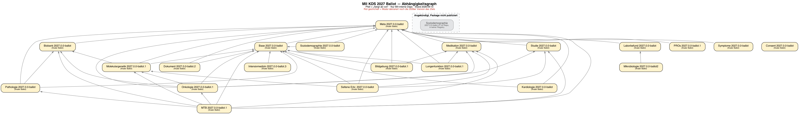
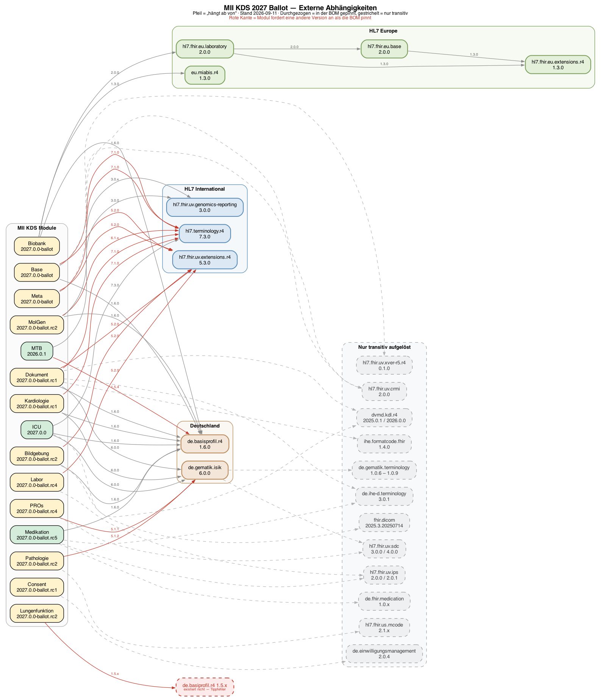

# Home - MII Kerndatensatz Complete v2027.0.0-ballot.19

* [**Table of Contents**](toc.md)
* **Home**

## Home

| | |
| :--- | :--- |
| *Official URL*:https://www.medizininformatik-initiative.de/fhir/core/complete/ImplementationGuide/de.medizininformatikinitiative.kerndatensatz.complete | *Version*:2027.0.0-ballot.19 |
| Active as of 2026-09-21 | *Computable Name*:MIIKerndatensatzComplete |

# MII Kerndatensatz Complete

Dieses Paket ist die **Bill of Materials (BOM)** des MII Kerndatensatzes — eine kuratierte Zusammenstellung aller KDS-Module mit ihren kompatiblen Versionen. Es enthält keine eigenen Profile, sondern definiert, welche Modulversionen zusammen getestet und freigegeben wurden.

### Warum eine BOM?

Die Module des Kerndatensatzes werden von verschiedenen Teams eigenständig weiterentwickelt und versioniert. Änderungen an einem Modul können Auswirkungen auf abhängige Module haben und müssen konsistent nach unten propagiert werden. Die BOM löst drei zentrale Herausforderungen:

1. **Konsistenz**: Sie stellt sicher, dass alle Modulversionen zueinander kompatibel sind und Änderungen in Abhängigkeiten berücksichtigt wurden.
1. **Verbindlichkeit**: Standorte und Projekte können sich auf einen definierten, geprüften Versionsstand des gesamten Kerndatensatzes beziehen.
1. **Flexibilität**: Modulteams können unabhängig weiterentwickeln und neue Versionen veröffentlichen. Standorte können bei Bedarf einzelne Module in neueren Versionen nutzen — etwa für projektspezifische Anforderungen — ohne auf ein neues BOM-Release warten zu müssen.

Während das [Meta-Modul](https://github.com/medizininformatik-initiative/kerndatensatz-meta) (`de.medizininformatikinitiative.kerndatensatz.meta`) modulübergreifende Ressourcen bereitstellt, die von den einzelnen KDS-Modulen als Grundlage genutzt werden (Extensions, CodeSystems, Naming-Conventions), dient dieses Complete-Paket als gebündelter Output: Eine einzelne Abhängigkeit, die alle Module des Kerndatensatzes in ein Projekt einbindet.

> **Ballot-Stand 2027.0.0 (Stand 2026-09-21)****ICU `2027.0.0-ballot.3`** (publiziert 2026-09-17) löst die letzte 2026er-Kante auf: das Modul deklariert jetzt Base und Meta `2027.0.0-ballot`, Basisprofile 1.6.0, ISiK 6.0.0, Terminology 7.3.0 und DVMD KDL 2026.0.0 — und enthält wieder alle fünf Score-Profile, die der versehentlich publizierten `2027.0.0` fehlen. **Damit ist die Ballot-Linie über alle 21 Module kohärent.** Die älteren Notizen unten beschreiben den Weg dorthin.Diese BOM bildet den laufenden Ballot ab: Module mit einem 2027.0.0-Release sind auf dieses gepinnt (Base, Meta, Biobank, Studie, Bildgebung, Dokument, ICU, Mikrobiologie), alle übrigen auf ihre höchste stabile 2026er Version.Die Ballot-Linie ist untereinander **noch nicht kohärent**: Die 2027.0.0-Releases deklarieren teilweise weiterhin die 2026er Basismodule als Abhängigkeit — Bildgebung erwartet Base 2026.0.1 und Meta 2026.0.0, Dokument erwartet Base 2026.0.0 und Meta 2026.0.0, Biobank und Studie erwarten Meta 2026.0.0, ICU 2027.0.0 erwartet Base 2026.0.1. Lediglich Base 2027.0.0-ballot.rc1 → Meta 2027.0.0-ballot.rc3 ist in sich stimmig.Beim Auflösen können Base und Meta dadurch transitiv in zwei Versionen gezogen werden, was bei der Validierung doppelte Canonicals erzeugt. Im Abhängigkeitsgraphen unten sind diese Stellen rot gestrichelt markiert. Diese BOM ist deshalb ein **Ballot-Arbeitsstand zum Review, kein freigegebener Versionsstand**.Neu in dieser BOM sind **Kardiologie** und **Lungenfunktion** (beide 2027.0.0-ballot.rc1). Lungenfunktion deklariert dabei die Abhängigkeit `de.basiprofil.r4` — ein Tippfehler, das Paket existiert nicht und die Abhängigkeit ist nicht auflösbar. **Soziodemographie** ist angekündigt, aber in keiner Registry publiziert und daher nicht gepinnt.**Meta ist in der finalen Ballot-Fassung**: `2027.0.0-ballot` vom 10.09.2026 löst `ballot.rc3` ab — 0 Errors statt 386, 182 statt 175 Ressourcen.**MolGen `2027.0.0-ballot.1`** verweist als erstes Modul durchgängig auf die finalen Fassungen von Base, Biobank und Meta. **Dokument** ist ebenfalls final, deklariert aber noch Base `ballot.rc1` und Meta `ballot.rc3`.**Dokument ist umgezogen**: `ballot.rc2` verweist auf Base und Meta der 2027er Linie — das letzte Modul, das noch an Base 2026.0.0 hing. **Medikation** ist in der finalen Fassung.**Neu in der BOM: Symptome** mit `2027.0.0-ballot` — vollständig kohärent und mit 0 QA-Errors. **PROs** ist ebenfalls final, hängt aber unverändert an Meta `2026.0.x`.**Base und Biobank sind ebenfalls in der finalen Ballot-Fassung** und verweisen auf Meta `2027.0.0-ballot`. Biobank hat dabei den Umzug auf **MIABIS 1.3.0** vollzogen.Vollständig auf 2027er Abhängigkeiten sind damit **Base, Biobank, Laborbefund, Medikation, MolGen und Pathologie**.Weiterhin am 2026er Stand hängen **PROs** (Meta 2026.0.x, unverändert seit 2026.7.0), **Lungenfunktion** (Base, Meta und Medikation je 2026.0.x — und weiterhin mit dem Tippfehler `de.basiprofil.r4`), **Bildgebung**, **Dokument**, **ICU**, **Kardiologie** sowie **Mikrobiologie**, das Laborbefund 2026.0.3 fordert.

## Gesamtübersicht

Alle Module dieser BOM auf einen Blick — die gepinnte Ballot-Version, das Package auf Simplifier und der aktuelle IG-Build. Details (GitHub-Repos, QA-Fehlerzahlen, Releases) stehen in den [Modultabellen](#module) weiter unten.

| | | | |
| :--- | :--- | :--- | :--- |
| Base | [`…kerndatensatz.base`](https://simplifier.net/packages/de.medizininformatikinitiative.kerndatensatz.base) | 2027.0.0-ballot | [IG](https://medizininformatik-initiative.github.io/kerndatensatz-basis/) |
| Meta | [`…kerndatensatz.meta`](https://simplifier.net/packages/de.medizininformatikinitiative.kerndatensatz.meta) | 2027.0.0-ballot | [IG](https://medizininformatik-initiative.github.io/kerndatensatz-meta/) |
| Medikation | [`…kerndatensatz.medikation`](https://simplifier.net/packages/de.medizininformatikinitiative.kerndatensatz.medikation) | 2027.0.0-ballot | [IG](https://medizininformatik-initiative.github.io/kerndatensatzmodul-medikation/) |
| Laborbefund | [`…kerndatensatz.laborbefund`](https://simplifier.net/packages/de.medizininformatikinitiative.kerndatensatz.laborbefund) | 2027.0.0-ballot | [IG](https://medizininformatik-initiative.github.io/kerndatensatzmodul-labor/) |
| Biobank | [`…kerndatensatz.biobank`](https://simplifier.net/packages/de.medizininformatikinitiative.kerndatensatz.biobank) | 2027.0.0-ballot | [IG](https://medizininformatik-initiative.github.io/kerndatensatzmodul-biobank/branches/release/v2027.0.0-ballot/) |
| ICU | [`…kerndatensatz.icu`](https://simplifier.net/packages/de.medizininformatikinitiative.kerndatensatz.icu) | 2027.0.0-ballot.3 | [IG](https://medizininformatik-initiative.github.io/kerndatensatzmodul-intensivmedizin/) |
| Mikrobiologie | [`…kerndatensatz.mikrobiologie`](https://simplifier.net/packages/de.medizininformatikinitiative.kerndatensatz.mikrobiologie) | 2027.0.0-ballot2 | [IG](https://medizininformatik-initiative.github.io/kerndatensatzmodul-mikrobiologie/) |
| Molekulargenetik | [`…kerndatensatz.molgen`](https://simplifier.net/packages/de.medizininformatikinitiative.kerndatensatz.molgen) | 2027.0.0-ballot.1 | [IG](https://medizininformatik-initiative.github.io/kerndatensatzmodul-GenetischeTests/) |
| Pathologie | [`…kerndatensatz.patho`](https://simplifier.net/packages/de.medizininformatikinitiative.kerndatensatz.patho) | 2027.0.0-ballot | [IG](https://medizininformatik-initiative.github.io/kerndatensatzmodul-PathologieBefund/branches/dev/v2027/) |
| Studie | [`…kerndatensatz.studie`](https://simplifier.net/packages/de.medizininformatikinitiative.kerndatensatz.studie) | 2027.0.0-ballot | [IG](https://medizininformatik-initiative.github.io/kerndatensatzmodul-studie/) |
| Bildgebung | [`…kerndatensatz.bildgebung`](https://simplifier.net/packages/de.medizininformatikinitiative.kerndatensatz.bildgebung) | 2027.0.0-ballot.1 | [IG](https://medizininformatik-initiative.github.io/kerndatensatz-bildgebung/) |
| Dokument | [`…kerndatensatz.dokument`](https://simplifier.net/packages/de.medizininformatikinitiative.kerndatensatz.dokument) | 2027.0.0-ballot.2 | [IG](https://medizininformatik-initiative.github.io/kerndatensatz-dokument/) |
| Onkologie | [`…kerndatensatz.onkologie`](https://simplifier.net/packages/de.medizininformatikinitiative.kerndatensatz.onkologie) | 2027.0.0-ballot.1 | [IG](https://medizininformatik-initiative.github.io/kerndatensatzmodul-onkologie/) |
| Seltene Erkrankungen | [`…kerndatensatz.seltene`](https://simplifier.net/packages/de.medizininformatikinitiative.kerndatensatz.seltene) | 2027.0.0-ballot | [IG](https://medizininformatik-initiative.github.io/kerndatensatzmodul-seltene-erkrankungen/) |
| Molekulares Tumorboard | [`…kerndatensatz.mtb`](https://simplifier.net/packages/de.medizininformatikinitiative.kerndatensatz.mtb) | 2027.0.0-ballot.1 | [IG](https://medizininformatik-initiative.github.io/kerndatensatzmodul-molekulares-tumorboard/) |
| PROs | [`…kerndatensatz.pros`](https://simplifier.net/packages/de.medizininformatikinitiative.kerndatensatz.pros) | 2027.0.0-ballot.1 | [IG](https://medizininformatik-initiative.github.io/kerndatensatzmodul-proms/) |
| Consent | [`…kerndatensatz.consent`](https://simplifier.net/packages/de.medizininformatikinitiative.kerndatensatz.consent) | 2027.0.0-ballot | [IG](https://medizininformatik-initiative.github.io/kerndatensatzmodul-consent/) |
| Kardiologie | [`…kerndatensatz.kardiologie`](https://simplifier.net/packages/de.medizininformatikinitiative.kerndatensatz.kardiologie) | 2027.0.0-ballot | [IG](https://medizininformatik-initiative.github.io/kerndatensatz-kardiologie/branches/release/v2027.0.0-ballot/) |
| Lungenfunktion | [`…kerndatensatz.lungenfunktion`](https://simplifier.net/packages/de.medizininformatikinitiative.kerndatensatz.lungenfunktion) | 2027.0.0-ballot.1 | [IG](https://medizininformatik-initiative.github.io/kerndatensatz-lungenfunktion/) |
| Symptome | [`…kerndatensatz.symptom`](https://simplifier.net/packages/de.medizininformatikinitiative.kerndatensatz.symptom) | 2027.0.0-ballot | [IG](https://medizininformatik-initiative.github.io/kerndatensatzmodul-symptome/) |
| Soziodemographie | [`…kerndatensatz.soziodemographie`](https://simplifier.net/packages/de.medizininformatikinitiative.kerndatensatz.soziodemographie) | 2027.0.0-ballot | [IG](https://medizininformatik-initiative.github.io/kerndatensatz-soziodemographie/) |

## Abhängigkeitsgraph



Automatisch generiert aus `dep-graph-2027.dot` via Graphviz. Knoten: grün = finale Version, gelb = Ballot/RC/Alpha, grau = in Entwicklung. Kanten: rot gestrichelt = das Modul deklariert noch die 2026er Version des Ziels, während diese BOM auf die 2027er Ballot-Linie pinnt.

## Module

> Die Einteilung in Basis- und Erweiterungsmodule folgt der bisherigen Konvention des Kerndatensatzes. Diese Kategorisierung spiegelt jedoch nicht den aktuellen Reifegrad, die Verbreitung oder den Innovationscharakter der einzelnen Module wider. Wir arbeiten derzeit an einer differenzierteren Klassifikation, die den dynamischen Entwicklungen im MII-Ökosystem besser gerecht wird.

### Basismodule

| | | | | | |
| :--- | :--- | :--- | :--- | :--- | :--- |
| Base (Person, Fall, Diagnose, Prozedur, Consent) | `de.medizininformatikinitiative.kerndatensatz.base` | 2027.0.0-ballot | [kerndatensatz-basis](https://github.com/medizininformatik-initiative/kerndatensatz-basis) | [2027.0.0-ballot](https://medizininformatik-initiative.github.io/kerndatensatz-basis/)· 22 Fehler | [v2027.0.0-ballot](https://github.com/medizininformatik-initiative/kerndatensatz-basis/releases/tag/v2027.0.0-ballot)(2026-09-10) |
| Meta | `de.medizininformatikinitiative.kerndatensatz.meta` | 2027.0.0-ballot | [kerndatensatz-meta](https://github.com/medizininformatik-initiative/kerndatensatz-meta) | [2027.0.0-ballot](https://medizininformatik-initiative.github.io/kerndatensatz-meta/)· 0 Fehler | [v2027.0.0-ballot](https://github.com/medizininformatik-initiative/kerndatensatz-meta/releases/tag/v2027.0.0-ballot)(2026-09-10) |
| Medikation | `de.medizininformatikinitiative.kerndatensatz.medikation` | 2027.0.0-ballot | [kerndatensatzmodul-medikation](https://github.com/medizininformatik-initiative/kerndatensatzmodul-medikation) | [2027.0.0-ballot](https://medizininformatik-initiative.github.io/kerndatensatzmodul-medikation/)· 1 Fehler | [v2027.0.0-ballot](https://github.com/medizininformatik-initiative/kerndatensatzmodul-medikation/releases/tag/v2027.0.0-ballot)(2026-09-11) |
| Laborbefund | `de.medizininformatikinitiative.kerndatensatz.laborbefund` | 2027.0.0-ballot | [kerndatensatzmodul-labor](https://github.com/medizininformatik-initiative/kerndatensatzmodul-labor) | [2027.0.0-ballot](https://medizininformatik-initiative.github.io/kerndatensatzmodul-labor/)· 37 Fehler | [v2027.0.0-ballot](https://github.com/medizininformatik-initiative/kerndatensatzmodul-labor/releases/tag/v2027.0.0-ballot)(2026-09-14) |

### Erweiterungsmodule

| | | | | | |
| :--- | :--- | :--- | :--- | :--- | :--- |
| Biobank | `de.medizininformatikinitiative.kerndatensatz.biobank` | 2027.0.0-ballot | [kerndatensatzmodul-biobank](https://github.com/medizininformatik-initiative/kerndatensatzmodul-biobank) | [2027.0.0-ballot](https://medizininformatik-initiative.github.io/kerndatensatzmodul-biobank/branches/release/v2027.0.0-ballot/)· 66 Fehler | [v2027.0.0-ballot](https://github.com/medizininformatik-initiative/kerndatensatzmodul-biobank/releases/tag/v2027.0.0-ballot)(2026-09-16) |
| ICU | `de.medizininformatikinitiative.kerndatensatz.icu` | 2027.0.0-ballot.3 | [kerndatensatzmodul-intensivmedizin](https://github.com/medizininformatik-initiative/kerndatensatzmodul-intensivmedizin) | [2027.0.0-ballot.3](https://medizininformatik-initiative.github.io/kerndatensatzmodul-intensivmedizin/)· 698 Fehler | [v2026.0.2](https://github.com/medizininformatik-initiative/kerndatensatzmodul-intensivmedizin/releases/tag/v2026.0.2)(2026-03-18) |
| Mikrobiologie | `de.medizininformatikinitiative.kerndatensatz.mikrobiologie` | 2027.0.0-ballot2 | [kerndatensatzmodul-mikrobiologie](https://github.com/medizininformatik-initiative/kerndatensatzmodul-mikrobiologie) | [2027.0.0-ballot2](https://medizininformatik-initiative.github.io/kerndatensatzmodul-mikrobiologie/)· 206 Fehler | [v2027.0.0-ballot2](https://github.com/medizininformatik-initiative/kerndatensatzmodul-mikrobiologie/releases/tag/v2027.0.0-ballot2)(2026-09-14) |
| Molekulargenetik | `de.medizininformatikinitiative.kerndatensatz.molgen` | 2027.0.0-ballot.1 | [kerndatensatzmodul-GenetischeTests](https://github.com/medizininformatik-initiative/kerndatensatzmodul-GenetischeTests) | [2027.0.0-ballot.1](https://medizininformatik-initiative.github.io/kerndatensatzmodul-GenetischeTests/)· 53 Fehler | [v2027.0.0-ballot.1](https://github.com/medizininformatik-initiative/kerndatensatzmodul-GenetischeTests/releases/tag/v2027.0.0-ballot.1)(2026-09-13) |
| Pathologie | `de.medizininformatikinitiative.kerndatensatz.patho` | 2027.0.0-ballot | [kerndatensatzmodul-PathologieBefund](https://github.com/medizininformatik-initiative/kerndatensatzmodul-PathologieBefund) | [2027.0.0-ballot](https://medizininformatik-initiative.github.io/kerndatensatzmodul-PathologieBefund/branches/dev/v2027/)· 25 Fehler | [v2027.0.0-ballot](https://github.com/medizininformatik-initiative/kerndatensatzmodul-PathologieBefund/releases/tag/v2027.0.0-ballot)(2026-09-14) |
| Studie | `de.medizininformatikinitiative.kerndatensatz.studie` | 2027.0.0-ballot | [kerndatensatzmodul-studie](https://github.com/medizininformatik-initiative/kerndatensatzmodul-studie) | [2027.0.0-ballot](https://medizininformatik-initiative.github.io/kerndatensatzmodul-studie/)· 0 Fehler | [v2027.0.0-ballot](https://github.com/medizininformatik-initiative/kerndatensatzmodul-studie/releases/tag/v2027.0.0-ballot)(2026-09-14) |
| Bildgebung | `de.medizininformatikinitiative.kerndatensatz.bildgebung` | 2027.0.0-ballot.1 | [kerndatensatz-bildgebung](https://github.com/medizininformatik-initiative/kerndatensatz-bildgebung) | [2027.0.0-ballot.1](https://medizininformatik-initiative.github.io/kerndatensatz-bildgebung/)· 29 Fehler | [v2027.0.0-ballot.1](https://github.com/medizininformatik-initiative/kerndatensatz-bildgebung/releases/tag/v2027.0.0-ballot.1)(2026-09-15) |
| Dokument | `de.medizininformatikinitiative.kerndatensatz.dokument` | 2027.0.0-ballot.2 | [kerndatensatz-dokument](https://github.com/medizininformatik-initiative/kerndatensatz-dokument) | [2027.0.0-ballot.2](https://medizininformatik-initiative.github.io/kerndatensatz-dokument/)· 2 Fehler | [v2027.0.0-ballot.2](https://github.com/medizininformatik-initiative/kerndatensatz-dokument/releases/tag/v2027.0.0-ballot.2)(2026-09-14) |
| Onkologie | `de.medizininformatikinitiative.kerndatensatz.onkologie` | 2027.0.0-ballot.1 | [kerndatensatzmodul-onkologie](https://github.com/medizininformatik-initiative/kerndatensatzmodul-onkologie) | [2027.0.0-ballot.1](https://medizininformatik-initiative.github.io/kerndatensatzmodul-onkologie/)· 4669 Fehler | [v2027.0.0-ballot.1](https://github.com/medizininformatik-initiative/kerndatensatzmodul-onkologie/releases/tag/v2027.0.0-ballot.1)(2026-09-15) |
| Seltene Erkrankungen | `de.medizininformatikinitiative.kerndatensatz.seltene` | 2027.0.0-ballot | [kerndatensatzmodul-seltene-erkrankungen](https://github.com/medizininformatik-initiative/kerndatensatzmodul-seltene-erkrankungen) | [2027.0.0-ballot](https://medizininformatik-initiative.github.io/kerndatensatzmodul-seltene-erkrankungen/)· 353 Fehler | [v2026.0.1](https://github.com/medizininformatik-initiative/kerndatensatzmodul-seltene-erkrankungen/releases/tag/v2026.0.1)(2026-03-30) |
| Molekulares Tumorboard | `de.medizininformatikinitiative.kerndatensatz.mtb` | 2027.0.0-ballot.1 | [kerndatensatzmodul-molekulares-tumorboard](https://github.com/medizininformatik-initiative/kerndatensatzmodul-molekulares-tumorboard) | [2027.0.0-ballot.1](https://medizininformatik-initiative.github.io/kerndatensatzmodul-molekulares-tumorboard/)· 55 Fehler | [v2027.0.0-ballot.1](https://github.com/medizininformatik-initiative/kerndatensatzmodul-molekulares-tumorboard/releases/tag/v2027.0.0-ballot.1)(2026-09-15) |
| PROs | `de.medizininformatikinitiative.kerndatensatz.pros` | 2027.0.0-ballot.1 | [kerndatensatzmodul-proms](https://github.com/medizininformatik-initiative/kerndatensatzmodul-proms) | [2027.0.0-ballot.1](https://medizininformatik-initiative.github.io/kerndatensatzmodul-proms/)· 214 Fehler | [v2027.0.0-ballot.rc5](https://github.com/medizininformatik-initiative/kerndatensatzmodul-proms/releases/tag/v2027.0.0-ballot.rc5)(2026-09-11) |
| Consent | `de.medizininformatikinitiative.kerndatensatz.consent` | 2027.0.0-ballot | [kerndatensatzmodul-consent](https://github.com/medizininformatik-initiative/kerndatensatzmodul-consent) | [2027.0.0-ballot](https://medizininformatik-initiative.github.io/kerndatensatzmodul-consent/)· 0 Fehler | [v2027.0.0-ballot](https://github.com/medizininformatik-initiative/kerndatensatzmodul-consent/releases/tag/v2027.0.0-ballot)(2026-09-14) |
| Kardiologie | `de.medizininformatikinitiative.kerndatensatz.kardiologie` | 2027.0.0-ballot | [kerndatensatz-kardiologie](https://github.com/medizininformatik-initiative/kerndatensatz-kardiologie) | [2027.0.0-ballot](https://medizininformatik-initiative.github.io/kerndatensatz-kardiologie/branches/release/v2027.0.0-ballot/)· 42 Fehler | [v2027.0.0-ballot](https://github.com/medizininformatik-initiative/kerndatensatz-kardiologie/releases/tag/v2027.0.0-ballot)(2026-09-14) |
| Lungenfunktion | `de.medizininformatikinitiative.kerndatensatz.lungenfunktion` | 2027.0.0-ballot.1 | [kerndatensatz-lungenfunktion](https://github.com/medizininformatik-initiative/kerndatensatz-lungenfunktion) | [2027.0.0-ballot.1](https://medizininformatik-initiative.github.io/kerndatensatz-lungenfunktion/)· 1147 Fehler | [v2027.0.0-ballot.1](https://github.com/medizininformatik-initiative/kerndatensatz-lungenfunktion/releases/tag/v2027.0.0-ballot.1)(2026-09-15) |
| Symptome | `de.medizininformatikinitiative.kerndatensatz.symptom` | 2027.0.0-ballot | [kerndatensatzmodul-symptome](https://github.com/medizininformatik-initiative/kerndatensatzmodul-symptome) | [2027.0.0-ballot](https://medizininformatik-initiative.github.io/kerndatensatzmodul-symptome/)· 0 Fehler | [v2027.0.0-ballot](https://github.com/medizininformatik-initiative/kerndatensatzmodul-symptome/releases/tag/v2027.0.0-ballot)(2026-09-11) |
| Soziodemographie | `de.medizininformatikinitiative.kerndatensatz.soziodemographie` | 2027.0.0-ballot | [kerndatensatz-soziodemographie](https://github.com/medizininformatik-initiative/kerndatensatz-soziodemographie) | [2027.0.0-ballot](https://medizininformatik-initiative.github.io/kerndatensatz-soziodemographie/)· 1 Fehler | [v2027.0.0-ballot](https://github.com/medizininformatik-initiative/kerndatensatz-soziodemographie/releases/tag/v2027.0.0-ballot)(2026-09-14) |

### Angekündigt, noch nicht publiziert

**Derzeit keine — Soziodemographie ist seit dem 16.09.2026 publiziert und in der Haupttabelle geführt.**

### Externe Abhängigkeiten

Die BOM pinnt nicht nur die MII-Module, sondern auch die externen Pakete, gegen die sie gebaut sind. Gepinnt wird jeweils **die höchste Version, die ein MII-Modul transitiv tatsächlich anfordert** — nicht die neueste verfügbare. Eine Version, gegen die kein Modul gebaut wurde, gehört nicht in eine BOM.

Pakete ohne Pin werden weiterhin transitiv aufgelöst; ihre Version ergibt sich aus dem anfordernden Modul.

#### In der BOM gepinnt

| | | | |
| :--- | :--- | :--- | :--- |
| Deutsche Basisprofile R4 (`de.basisprofil.r4`) | 1.6.0 | Base, Biobank, ICU, Bildgebung, Dokument, Kardiologie | ältere Module fordern noch 1.5.x; Lungenfunktion fordert das nicht existierende`de.basiprofil.r4` |
| HL7 Terminology (`hl7.terminology.r4`) | 7.3.0 | ICU 2027.0.0 | Module uneinig: 5.0.0 / 6.1.0 / 6.5.0 / 7.1.0 / 7.2.0 / 7.3.0 |
| HL7 Extensions R4 (`hl7.fhir.uv.extensions.r4`) | 5.3.0 | Base 2026.0.1, CRMI 2.0.0 | Module uneinig: 5.1.0 / 5.2.0 / 5.3.0 |
| HL7 Clinical Genomics (`hl7.fhir.uv.genomics-reporting`) | 3.0.0 | Molekulargenetik, MTB | einheitlich |
| HL7 Europe Base (`hl7.fhir.eu.base`) | 2.0.0 | EU Laboratory (transitiv über Biobank) | einheitlich |
| HL7 Europe Laboratory (`hl7.fhir.eu.laboratory`) | 2.0.0 | Biobank 2027.0.0-ballot.rc1 | einheitlich |
| HL7 Europe Extensions R4 (`hl7.fhir.eu.extensions.r4`) | 1.3.0 | EU Base, EU Laboratory | einheitlich |
| MIABIS (`eu.miabis.r4`) | 1.3.0 | Biobank | Umzug auf die neuen MIABIS-Pfade in`2027.0.0-ballot`vollzogen |
| ISiK (`de.gematik.isik`) | 6.0.0 | ICU 2027.0.0, Dokument 2027.0.0-ballot.rc1, Kardiologie | Pathologie fordert 5.1.2, PROs 5.1.1 |

#### Nur transitiv aufgelöst

| | | |
| :--- | :--- | :--- |
| Einwilligungsmanagement (`de.einwilligungsmanagement`) | 2.0.4 | Consent |
| Deutsche Medikation (`de.fhir.medication`) | 1.0.x | Medikation |
| IHE-D Terminologie (`de.ihe-d.terminology`) | 3.0.1 | Medikation, Dokument |
| gematik Terminologie (`de.gematik.terminology`) | 1.0.6 – 1.0.9 | ISiK (transitiv) |
| DVMD KDL (`dvmd.kdl.r4`) | 2025.0.1 (Dokument), 2026.0.0 (ICU) | Dokument, ICU |
| DICOM (`fhir.dicom`) | 2025.3.20250714 | Bildgebung |
| IHE FormatCode (`ihe.formatcode.fhir`) | 1.4.0 | Dokument |
| HL7 International Patient Summary (`hl7.fhir.uv.ips`) | 2.0.0 (Medikation), 2.0.1 (Laborbefund) | Medikation, Laborbefund |
| HL7 Structured Data Capture (`hl7.fhir.uv.sdc`) | 3.0.0 (PROs), 4.0.0 (ISiK 6.0.0) | PROs, ISiK |
| HL7 mCODE (`hl7.fhir.us.mcode`) | 2.1.x | Pathologie |
| HL7 CRMI (`hl7.fhir.uv.crmi`) | 2.0.0 | Base, Meta |
| HL7 Cross-Version R5 (`hl7.fhir.uv.xver-r5.r4`) | 0.1.0 | Base, EU Laboratory, ISiK |

#### Graph der externen Abhängigkeiten



Automatisch generiert aus `dep-graph-2027-extern.dot` via Graphviz. Durchgezogene Kästen = in der BOM gepinnt, gestrichelt = nur transitiv aufgelöst. Rote Kantenbeschriftung = das Modul fordert eine andere Version an als die BOM pinnt.

## Installation

### Über die FHIR Package Registry (empfohlen)

Sobald das Paket auf packages.fhir.org verfügbar ist, genügt eine einzelne Abhängigkeit in der `sushi-config.yaml`:

```
dependencies:
  de.medizininformatikinitiative.kerndatensatz.complete: 2027.0.0-ballot.12

```

Alle 20 Modul-Dependencies und die 8 gepinnten externen Pakete werden automatisch von der FHIR Package Registry aufgelöst und heruntergeladen.

### Manuelle Installation

Solange das Paket noch nicht auf packages.fhir.org verfügbar ist, kann es vom [GitHub Release](https://github.com/medizininformatik-initiative/kerndatensatz-complete/releases/tag/v2027.0.0-ballot.12) heruntergeladen und lokal installiert werden:

```
# Package herunterladen
curl -LO https://github.com/medizininformatik-initiative/kerndatensatz-complete/releases/download/v2027.0.0-ballot.12/de.medizininformatikinitiative.kerndatensatz.complete-2027.0.0-ballot.12.tgz

# In den lokalen FHIR-Cache installieren
fhir install de.medizininformatikinitiative.kerndatensatz.complete-2027.0.0-ballot.12.tgz

```

Danach kann das Paket wie gewohnt als Dependency referenziert werden. Alle weiteren Module werden automatisch von packages.fhir.org aufgelöst.

> **Hinweis:** Der `fhir`-Befehl stammt aus dem [Firely Terminal (Simplifier CLI)](https://simplifier.net/downloads/firely-terminal). Im Zweifel Version 3.4.0 verwenden — neuere Versionen sind nicht getestet.

```
dotnet tool install -g Firely.Terminal --version 3.4.0

```


## Weitere Informationen

* [Alle KDS-Repositories auf GitHub](https://github.com/orgs/medizininformatik-initiative/repositories?q=kerndatensatzmodul)
* [Übersicht über Versionen der KDS-Module](https://github.com/medizininformatik-initiative/kerndatensatz-meta/wiki/%C3%9Cbersicht-%C3%BCber-Versionen-der-Kerndatensatz%E2%80%90Module)
* [MII Kerndatensatz Meta Wiki](https://github.com/medizininformatik-initiative/kerndatensatz-meta/wiki)
* [MII Kerndatensatz auf Art-Decor](https://art-decor.org/art-decor/decor-project--mide-)
* [MII GitHub Organisation](https://github.com/medizininformatik-initiative)
* [MII FHIR Packages auf Simplifier](https://simplifier.net/organization/koordinationsstellemii/~packages)


## Resource Content

```json
{
  "resourceType" : "ImplementationGuide",
  "id" : "de.medizininformatikinitiative.kerndatensatz.complete",
  "url" : "https://www.medizininformatik-initiative.de/fhir/core/complete/ImplementationGuide/de.medizininformatikinitiative.kerndatensatz.complete",
  "version" : "2027.0.0-ballot.19",
  "name" : "MIIKerndatensatzComplete",
  "title" : "MII Kerndatensatz Complete",
  "status" : "active",
  "date" : "2026-09-21T12:43:44+00:00",
  "publisher" : "Medizininformatik Initiative",
  "contact" : [{
    "name" : "Medizininformatik Initiative",
    "telecom" : [{
      "system" : "url",
      "value" : "https://www.medizininformatik-initiative.de"
    }]
  }],
  "description" : "Bill of Materials (BOM) aller Module des MII Kerndatensatzes samt gepinnter externer Abhaengigkeiten (Ballot-Stand 2027.0.0)",
  "jurisdiction" : [{
    "coding" : [{
      "system" : "urn:iso:std:iso:3166",
      "code" : "DE",
      "display" : "Germany"
    }]
  }],
  "packageId" : "de.medizininformatikinitiative.kerndatensatz.complete",
  "license" : "CC-BY-4.0",
  "fhirVersion" : ["4.0.1"],
  "dependsOn" : [{
    "id" : "de_basisprofil_r4",
    "uri" : "http://fhir.org/packages/de.basisprofil.r4/ImplementationGuide/de.basisprofil.r4",
    "packageId" : "de.basisprofil.r4",
    "version" : "1.6.0"
  },
  {
    "id" : "de_medizininformatikinitiative_kerndatensatz_base",
    "uri" : "https://www.medizininformatik-initiative.de/fhir/modul-base/ImplementationGuide/mii-ig-base",
    "packageId" : "de.medizininformatikinitiative.kerndatensatz.base",
    "version" : "2027.0.0-ballot"
  },
  {
    "id" : "de_medizininformatikinitiative_kerndatensatz_meta",
    "uri" : "https://www.medizininformatik-initiative.de/fhir/modul-meta/ImplementationGuide/mii-ig-meta",
    "packageId" : "de.medizininformatikinitiative.kerndatensatz.meta",
    "version" : "2027.0.0-ballot"
  },
  {
    "id" : "de_medizininformatikinitiative_kerndatensatz_medikation",
    "uri" : "https://www.medizininformatik-initiative.de/fhir/core/modul-medikation/ImplementationGuide/mii-ig-medikation",
    "packageId" : "de.medizininformatikinitiative.kerndatensatz.medikation",
    "version" : "2027.0.0-ballot"
  },
  {
    "id" : "de_medizininformatikinitiative_kerndatensatz_laborbefund",
    "uri" : "http://fhir.org/packages/de.medizininformatikinitiative.kerndatensatz.laborbefund/ImplementationGuide/de.medizininformatikinitiative.kerndatensatz.laborbefund",
    "packageId" : "de.medizininformatikinitiative.kerndatensatz.laborbefund",
    "version" : "2027.0.0-ballot"
  },
  {
    "id" : "de_medizininformatikinitiative_kerndatensatz_biobank",
    "uri" : "https://www.medizininformatik-initiative.de/fhir/ext/modul-biobank/ImplementationGuide/mii-ig-biobank",
    "packageId" : "de.medizininformatikinitiative.kerndatensatz.biobank",
    "version" : "2027.0.0-ballot"
  },
  {
    "id" : "de_medizininformatikinitiative_kerndatensatz_icu",
    "uri" : "https://www.medizininformatik-initiative.de/fhir/ext/modul-icu/ImplementationGuide/mii-ig-icu",
    "packageId" : "de.medizininformatikinitiative.kerndatensatz.icu",
    "version" : "2027.0.0-ballot.3"
  },
  {
    "id" : "de_medizininformatikinitiative_kerndatensatz_mikrobiologie",
    "uri" : "http://fhir.org/packages/de.medizininformatikinitiative.kerndatensatz.mikrobiologie/ImplementationGuide/de.medizininformatikinitiative.kerndatensatz.mikrobiologie",
    "packageId" : "de.medizininformatikinitiative.kerndatensatz.mikrobiologie",
    "version" : "2027.0.0-ballot2"
  },
  {
    "id" : "de_medizininformatikinitiative_kerndatensatz_molgen",
    "uri" : "https://www.medizininformatik-initiative.de/fhir/ext/modul-molgen/ImplementationGuide/mii-ig-molgen",
    "packageId" : "de.medizininformatikinitiative.kerndatensatz.molgen",
    "version" : "2027.0.0-ballot.1"
  },
  {
    "id" : "de_medizininformatikinitiative_kerndatensatz_patho",
    "uri" : "https://www.medizininformatik-initiative.de/fhir/ext/modul-patho",
    "packageId" : "de.medizininformatikinitiative.kerndatensatz.patho",
    "version" : "2027.0.0-ballot"
  },
  {
    "id" : "de_medizininformatikinitiative_kerndatensatz_studie",
    "uri" : "https://www.medizininformatik-initiative.de/fhir/modul-studie/ImplementationGuide/mii-ig-studie",
    "packageId" : "de.medizininformatikinitiative.kerndatensatz.studie",
    "version" : "2027.0.0-ballot"
  },
  {
    "id" : "de_medizininformatikinitiative_kerndatensatz_bildgebung",
    "uri" : "http://fhir.org/packages/de.medizininformatikinitiative.kerndatensatz.bildgebung/ImplementationGuide/de.medizininformatikinitiative.kerndatensatz.bildgebung",
    "packageId" : "de.medizininformatikinitiative.kerndatensatz.bildgebung",
    "version" : "2027.0.0-ballot.1"
  },
  {
    "id" : "de_medizininformatikinitiative_kerndatensatz_dokument",
    "uri" : "https://www.medizininformatik-initiative.de/fhir/ext/modul-dokument/ImplementationGuide/mii-ig-dokument",
    "packageId" : "de.medizininformatikinitiative.kerndatensatz.dokument",
    "version" : "2027.0.0-ballot.2"
  },
  {
    "id" : "de_medizininformatikinitiative_kerndatensatz_onkologie",
    "uri" : "https://www.medizininformatik-initiative.de/fhir/ext/modul-onko/ImplementationGuide/mii-ig-onko-de",
    "packageId" : "de.medizininformatikinitiative.kerndatensatz.onkologie",
    "version" : "2027.0.0-ballot.1"
  },
  {
    "id" : "de_medizininformatikinitiative_kerndatensatz_seltene",
    "uri" : "https://www.medizininformatik-initiative.de/fhir/ext/modul-seltene/ImplementationGuide/mii-ig-seltene",
    "packageId" : "de.medizininformatikinitiative.kerndatensatz.seltene",
    "version" : "2027.0.0-ballot"
  },
  {
    "id" : "de_medizininformatikinitiative_kerndatensatz_mtb",
    "uri" : "https://www.medizininformatik-initiative.de/fhir/ext/modul-mtb/ImplementationGuide/mii-ig-mtb",
    "packageId" : "de.medizininformatikinitiative.kerndatensatz.mtb",
    "version" : "2027.0.0-ballot.1"
  },
  {
    "id" : "de_medizininformatikinitiative_kerndatensatz_pros",
    "uri" : "https://www.medizininformatik-initiative.de/fhir/ext/modul-pro/ImplementationGuide/mii-ig-pro",
    "packageId" : "de.medizininformatikinitiative.kerndatensatz.pros",
    "version" : "2027.0.0-ballot.1"
  },
  {
    "id" : "de_medizininformatikinitiative_kerndatensatz_kardiologie",
    "uri" : "https://www.medizininformatik-initiative.de/fhir/ext/modul-kardio/",
    "packageId" : "de.medizininformatikinitiative.kerndatensatz.kardiologie",
    "version" : "2027.0.0-ballot"
  },
  {
    "id" : "de_medizininformatikinitiative_kerndatensatz_lungenfunktion",
    "uri" : "http://fhir.org/packages/de.medizininformatikinitiative.kerndatensatz.lungenfunktion/ImplementationGuide/de.medizininformatikinitiative.kerndatensatz.lungenfunktion",
    "packageId" : "de.medizininformatikinitiative.kerndatensatz.lungenfunktion",
    "version" : "2027.0.0-ballot.1"
  },
  {
    "id" : "de_medizininformatikinitiative_kerndatensatz_symptom",
    "uri" : "https://www.medizininformatik-initiative.de/fhir/modul-symptom/ImplementationGuide/mii-ig-symptom",
    "packageId" : "de.medizininformatikinitiative.kerndatensatz.symptom",
    "version" : "2027.0.0-ballot"
  },
  {
    "id" : "de_medizininformatikinitiative_kerndatensatz_soziodemographie",
    "uri" : "https://www.medizininformatik-initiative.de/fhir/ext/modul-soziodemographie/ImplementationGuide/mii-ig-soziodemographie",
    "packageId" : "de.medizininformatikinitiative.kerndatensatz.soziodemographie",
    "version" : "2027.0.0-ballot"
  },
  {
    "id" : "de_medizininformatikinitiative_kerndatensatz_consent",
    "uri" : "https://www.medizininformatik-initiative.de/fhir/modul-consent/ImplementationGuide/mii-ig-consent",
    "packageId" : "de.medizininformatikinitiative.kerndatensatz.consent",
    "version" : "2027.0.0-ballot"
  },
  {
    "id" : "hl7_terminology_r4",
    "uri" : "http://terminology.hl7.org/ImplementationGuide/hl7.terminology",
    "packageId" : "hl7.terminology.r4",
    "version" : "7.3.0"
  },
  {
    "id" : "hl7_fhir_uv_extensions_r4",
    "uri" : "http://hl7.org/fhir/extensions/ImplementationGuide/hl7.fhir.uv.extensions",
    "packageId" : "hl7.fhir.uv.extensions.r4",
    "version" : "5.3.0"
  },
  {
    "id" : "hl7_fhir_uv_genomics_reporting",
    "uri" : "http://hl7.org/fhir/uv/genomics-reporting/ImplementationGuide/hl7.fhir.uv.genomics-reporting",
    "packageId" : "hl7.fhir.uv.genomics-reporting",
    "version" : "3.0.0"
  },
  {
    "id" : "hl7_fhir_eu_base",
    "uri" : "http://hl7.eu/fhir/base/ImplementationGuide/hl7.fhir.eu.base",
    "packageId" : "hl7.fhir.eu.base",
    "version" : "2.0.0"
  },
  {
    "id" : "hl7_fhir_eu_laboratory",
    "uri" : "http://hl7.eu/fhir/laboratory/ImplementationGuide/hl7.fhir.eu.laboratory",
    "packageId" : "hl7.fhir.eu.laboratory",
    "version" : "2.0.0"
  },
  {
    "id" : "hl7_fhir_eu_extensions_r4",
    "uri" : "http://hl7.eu/fhir/extensions/ImplementationGuide/hl7.fhir.eu.extensions",
    "packageId" : "hl7.fhir.eu.extensions.r4",
    "version" : "1.3.0"
  },
  {
    "id" : "eu_miabis_r4",
    "uri" : "https://fhir.miabis.bbmri-eric.eu",
    "packageId" : "eu.miabis.r4",
    "version" : "1.3.0"
  },
  {
    "id" : "de_gematik_isik",
    "uri" : "http://fhir.org/packages/de.gematik.isik/ImplementationGuide/de.gematik.isik",
    "packageId" : "de.gematik.isik",
    "version" : "6.0.0"
  }],
  "definition" : {
    "extension" : [{
      "extension" : [{
        "url" : "code",
        "valueString" : "copyrightyear"
      },
      {
        "url" : "value",
        "valueString" : "2025+"
      }],
      "url" : "http://hl7.org/fhir/tools/StructureDefinition/ig-parameter"
    },
    {
      "extension" : [{
        "url" : "code",
        "valueString" : "releaselabel"
      },
      {
        "url" : "value",
        "valueString" : "ballot"
      }],
      "url" : "http://hl7.org/fhir/tools/StructureDefinition/ig-parameter"
    },
    {
      "extension" : [{
        "url" : "code",
        "valueString" : "autoload-resources"
      },
      {
        "url" : "value",
        "valueString" : "true"
      }],
      "url" : "http://hl7.org/fhir/tools/StructureDefinition/ig-parameter"
    },
    {
      "extension" : [{
        "url" : "code",
        "valueString" : "path-liquid"
      },
      {
        "url" : "value",
        "valueString" : "template/liquid"
      }],
      "url" : "http://hl7.org/fhir/tools/StructureDefinition/ig-parameter"
    },
    {
      "extension" : [{
        "url" : "code",
        "valueString" : "path-liquid"
      },
      {
        "url" : "value",
        "valueString" : "input/liquid"
      }],
      "url" : "http://hl7.org/fhir/tools/StructureDefinition/ig-parameter"
    },
    {
      "extension" : [{
        "url" : "code",
        "valueString" : "path-qa"
      },
      {
        "url" : "value",
        "valueString" : "temp/qa"
      }],
      "url" : "http://hl7.org/fhir/tools/StructureDefinition/ig-parameter"
    },
    {
      "extension" : [{
        "url" : "code",
        "valueString" : "path-temp"
      },
      {
        "url" : "value",
        "valueString" : "temp/pages"
      }],
      "url" : "http://hl7.org/fhir/tools/StructureDefinition/ig-parameter"
    },
    {
      "extension" : [{
        "url" : "code",
        "valueString" : "path-output"
      },
      {
        "url" : "value",
        "valueString" : "output"
      }],
      "url" : "http://hl7.org/fhir/tools/StructureDefinition/ig-parameter"
    },
    {
      "extension" : [{
        "url" : "code",
        "valueString" : "path-suppressed-warnings"
      },
      {
        "url" : "value",
        "valueString" : "input/ignoreWarnings.txt"
      }],
      "url" : "http://hl7.org/fhir/tools/StructureDefinition/ig-parameter"
    },
    {
      "extension" : [{
        "url" : "code",
        "valueString" : "path-history"
      },
      {
        "url" : "value",
        "valueString" : "https://www.medizininformatik-initiative.de/fhir/core/complete/history.html"
      }],
      "url" : "http://hl7.org/fhir/tools/StructureDefinition/ig-parameter"
    },
    {
      "extension" : [{
        "url" : "code",
        "valueString" : "template-html"
      },
      {
        "url" : "value",
        "valueString" : "template-page.html"
      }],
      "url" : "http://hl7.org/fhir/tools/StructureDefinition/ig-parameter"
    },
    {
      "extension" : [{
        "url" : "code",
        "valueString" : "template-md"
      },
      {
        "url" : "value",
        "valueString" : "template-page-md.html"
      }],
      "url" : "http://hl7.org/fhir/tools/StructureDefinition/ig-parameter"
    },
    {
      "extension" : [{
        "url" : "code",
        "valueString" : "apply-contact"
      },
      {
        "url" : "value",
        "valueString" : "true"
      }],
      "url" : "http://hl7.org/fhir/tools/StructureDefinition/ig-parameter"
    },
    {
      "extension" : [{
        "url" : "code",
        "valueString" : "apply-context"
      },
      {
        "url" : "value",
        "valueString" : "true"
      }],
      "url" : "http://hl7.org/fhir/tools/StructureDefinition/ig-parameter"
    },
    {
      "extension" : [{
        "url" : "code",
        "valueString" : "apply-copyright"
      },
      {
        "url" : "value",
        "valueString" : "true"
      }],
      "url" : "http://hl7.org/fhir/tools/StructureDefinition/ig-parameter"
    },
    {
      "extension" : [{
        "url" : "code",
        "valueString" : "apply-jurisdiction"
      },
      {
        "url" : "value",
        "valueString" : "true"
      }],
      "url" : "http://hl7.org/fhir/tools/StructureDefinition/ig-parameter"
    },
    {
      "extension" : [{
        "url" : "code",
        "valueString" : "apply-license"
      },
      {
        "url" : "value",
        "valueString" : "true"
      }],
      "url" : "http://hl7.org/fhir/tools/StructureDefinition/ig-parameter"
    },
    {
      "extension" : [{
        "url" : "code",
        "valueString" : "apply-publisher"
      },
      {
        "url" : "value",
        "valueString" : "true"
      }],
      "url" : "http://hl7.org/fhir/tools/StructureDefinition/ig-parameter"
    },
    {
      "extension" : [{
        "url" : "code",
        "valueString" : "apply-version"
      },
      {
        "url" : "value",
        "valueString" : "true"
      }],
      "url" : "http://hl7.org/fhir/tools/StructureDefinition/ig-parameter"
    },
    {
      "extension" : [{
        "url" : "code",
        "valueString" : "apply-wg"
      },
      {
        "url" : "value",
        "valueString" : "true"
      }],
      "url" : "http://hl7.org/fhir/tools/StructureDefinition/ig-parameter"
    },
    {
      "extension" : [{
        "url" : "code",
        "valueString" : "active-tables"
      },
      {
        "url" : "value",
        "valueString" : "true"
      }],
      "url" : "http://hl7.org/fhir/tools/StructureDefinition/ig-parameter"
    },
    {
      "extension" : [{
        "url" : "code",
        "valueString" : "fmm-definition"
      },
      {
        "url" : "value",
        "valueString" : "http://hl7.org/fhir/versions.html#maturity"
      }],
      "url" : "http://hl7.org/fhir/tools/StructureDefinition/ig-parameter"
    },
    {
      "extension" : [{
        "url" : "code",
        "valueString" : "propagate-status"
      },
      {
        "url" : "value",
        "valueString" : "true"
      }],
      "url" : "http://hl7.org/fhir/tools/StructureDefinition/ig-parameter"
    },
    {
      "extension" : [{
        "url" : "code",
        "valueString" : "excludelogbinaryformat"
      },
      {
        "url" : "value",
        "valueString" : "true"
      }],
      "url" : "http://hl7.org/fhir/tools/StructureDefinition/ig-parameter"
    },
    {
      "extension" : [{
        "url" : "code",
        "valueString" : "tabbed-snapshots"
      },
      {
        "url" : "value",
        "valueString" : "true"
      }],
      "url" : "http://hl7.org/fhir/tools/StructureDefinition/ig-parameter"
    },
    {
      "url" : "http://hl7.org/fhir/tools/StructureDefinition/ig-internal-dependency",
      "valueCode" : "hl7.fhir.uv.tools.r4#1.1.2"
    },
    {
      "extension" : [{
        "url" : "code",
        "valueCode" : "copyrightyear"
      },
      {
        "url" : "value",
        "valueString" : "2025+"
      }],
      "url" : "http://hl7.org/fhir/tools/StructureDefinition/ig-parameter"
    },
    {
      "extension" : [{
        "url" : "code",
        "valueCode" : "releaselabel"
      },
      {
        "url" : "value",
        "valueString" : "ballot"
      }],
      "url" : "http://hl7.org/fhir/tools/StructureDefinition/ig-parameter"
    },
    {
      "extension" : [{
        "url" : "code",
        "valueCode" : "autoload-resources"
      },
      {
        "url" : "value",
        "valueString" : "true"
      }],
      "url" : "http://hl7.org/fhir/tools/StructureDefinition/ig-parameter"
    },
    {
      "extension" : [{
        "url" : "code",
        "valueCode" : "path-liquid"
      },
      {
        "url" : "value",
        "valueString" : "template/liquid"
      }],
      "url" : "http://hl7.org/fhir/tools/StructureDefinition/ig-parameter"
    },
    {
      "extension" : [{
        "url" : "code",
        "valueCode" : "path-liquid"
      },
      {
        "url" : "value",
        "valueString" : "input/liquid"
      }],
      "url" : "http://hl7.org/fhir/tools/StructureDefinition/ig-parameter"
    },
    {
      "extension" : [{
        "url" : "code",
        "valueCode" : "path-qa"
      },
      {
        "url" : "value",
        "valueString" : "temp/qa"
      }],
      "url" : "http://hl7.org/fhir/tools/StructureDefinition/ig-parameter"
    },
    {
      "extension" : [{
        "url" : "code",
        "valueCode" : "path-temp"
      },
      {
        "url" : "value",
        "valueString" : "temp/pages"
      }],
      "url" : "http://hl7.org/fhir/tools/StructureDefinition/ig-parameter"
    },
    {
      "extension" : [{
        "url" : "code",
        "valueCode" : "path-output"
      },
      {
        "url" : "value",
        "valueString" : "output"
      }],
      "url" : "http://hl7.org/fhir/tools/StructureDefinition/ig-parameter"
    },
    {
      "extension" : [{
        "url" : "code",
        "valueCode" : "path-suppressed-warnings"
      },
      {
        "url" : "value",
        "valueString" : "input/ignoreWarnings.txt"
      }],
      "url" : "http://hl7.org/fhir/tools/StructureDefinition/ig-parameter"
    },
    {
      "extension" : [{
        "url" : "code",
        "valueCode" : "path-history"
      },
      {
        "url" : "value",
        "valueString" : "https://www.medizininformatik-initiative.de/fhir/core/complete/history.html"
      }],
      "url" : "http://hl7.org/fhir/tools/StructureDefinition/ig-parameter"
    },
    {
      "extension" : [{
        "url" : "code",
        "valueCode" : "template-html"
      },
      {
        "url" : "value",
        "valueString" : "template-page.html"
      }],
      "url" : "http://hl7.org/fhir/tools/StructureDefinition/ig-parameter"
    },
    {
      "extension" : [{
        "url" : "code",
        "valueCode" : "template-md"
      },
      {
        "url" : "value",
        "valueString" : "template-page-md.html"
      }],
      "url" : "http://hl7.org/fhir/tools/StructureDefinition/ig-parameter"
    },
    {
      "extension" : [{
        "url" : "code",
        "valueCode" : "apply-contact"
      },
      {
        "url" : "value",
        "valueString" : "true"
      }],
      "url" : "http://hl7.org/fhir/tools/StructureDefinition/ig-parameter"
    },
    {
      "extension" : [{
        "url" : "code",
        "valueCode" : "apply-context"
      },
      {
        "url" : "value",
        "valueString" : "true"
      }],
      "url" : "http://hl7.org/fhir/tools/StructureDefinition/ig-parameter"
    },
    {
      "extension" : [{
        "url" : "code",
        "valueCode" : "apply-copyright"
      },
      {
        "url" : "value",
        "valueString" : "true"
      }],
      "url" : "http://hl7.org/fhir/tools/StructureDefinition/ig-parameter"
    },
    {
      "extension" : [{
        "url" : "code",
        "valueCode" : "apply-jurisdiction"
      },
      {
        "url" : "value",
        "valueString" : "true"
      }],
      "url" : "http://hl7.org/fhir/tools/StructureDefinition/ig-parameter"
    },
    {
      "extension" : [{
        "url" : "code",
        "valueCode" : "apply-license"
      },
      {
        "url" : "value",
        "valueString" : "true"
      }],
      "url" : "http://hl7.org/fhir/tools/StructureDefinition/ig-parameter"
    },
    {
      "extension" : [{
        "url" : "code",
        "valueCode" : "apply-publisher"
      },
      {
        "url" : "value",
        "valueString" : "true"
      }],
      "url" : "http://hl7.org/fhir/tools/StructureDefinition/ig-parameter"
    },
    {
      "extension" : [{
        "url" : "code",
        "valueCode" : "apply-version"
      },
      {
        "url" : "value",
        "valueString" : "true"
      }],
      "url" : "http://hl7.org/fhir/tools/StructureDefinition/ig-parameter"
    },
    {
      "extension" : [{
        "url" : "code",
        "valueCode" : "apply-wg"
      },
      {
        "url" : "value",
        "valueString" : "true"
      }],
      "url" : "http://hl7.org/fhir/tools/StructureDefinition/ig-parameter"
    },
    {
      "extension" : [{
        "url" : "code",
        "valueCode" : "active-tables"
      },
      {
        "url" : "value",
        "valueString" : "true"
      }],
      "url" : "http://hl7.org/fhir/tools/StructureDefinition/ig-parameter"
    },
    {
      "extension" : [{
        "url" : "code",
        "valueCode" : "fmm-definition"
      },
      {
        "url" : "value",
        "valueString" : "http://hl7.org/fhir/versions.html#maturity"
      }],
      "url" : "http://hl7.org/fhir/tools/StructureDefinition/ig-parameter"
    },
    {
      "extension" : [{
        "url" : "code",
        "valueCode" : "propagate-status"
      },
      {
        "url" : "value",
        "valueString" : "true"
      }],
      "url" : "http://hl7.org/fhir/tools/StructureDefinition/ig-parameter"
    },
    {
      "extension" : [{
        "url" : "code",
        "valueCode" : "excludelogbinaryformat"
      },
      {
        "url" : "value",
        "valueString" : "true"
      }],
      "url" : "http://hl7.org/fhir/tools/StructureDefinition/ig-parameter"
    },
    {
      "extension" : [{
        "url" : "code",
        "valueCode" : "tabbed-snapshots"
      },
      {
        "url" : "value",
        "valueString" : "true"
      }],
      "url" : "http://hl7.org/fhir/tools/StructureDefinition/ig-parameter"
    }],
    "resource" : [{
      "extension" : [{
        "url" : "http://hl7.org/fhir/tools/StructureDefinition/resource-information",
        "valueString" : "CapabilityStatement"
      },
      {
        "url" : "http://hl7.org/fhir/StructureDefinition/implementationguide-page",
        "valueUri" : "CapabilityStatement-mii-cps-kerndatensatz-complete.html"
      }],
      "reference" : {
        "reference" : "CapabilityStatement/mii-cps-kerndatensatz-complete"
      },
      "name" : "MII CPS Kerndatensatz Complete CapabilityStatement",
      "description" : "Aggregiertes CapabilityStatement des MII Kerndatensatz Complete-Pakets. Beschreibt alle verpflichtenden Interaktionen, Profile und Suchparameter aus allen Modulen des MII Kerndatensatzes, die ein konformes System unterstützen muss.",
      "exampleBoolean" : false
    }],
    "page" : {
      "extension" : [{
        "url" : "http://hl7.org/fhir/tools/StructureDefinition/ig-page-name",
        "valueUrl" : "toc.html"
      }],
      "nameUrl" : "toc.html",
      "title" : "Table of Contents",
      "generation" : "html",
      "page" : [{
        "extension" : [{
          "url" : "http://hl7.org/fhir/tools/StructureDefinition/ig-page-name",
          "valueUrl" : "index.html"
        }],
        "nameUrl" : "index.html",
        "title" : "Home",
        "generation" : "markdown"
      },
      {
        "extension" : [{
          "url" : "http://hl7.org/fhir/tools/StructureDefinition/ig-page-name",
          "valueUrl" : "ballot.html"
        }],
        "nameUrl" : "ballot.html",
        "title" : "Ballot",
        "generation" : "markdown"
      }]
    },
    "parameter" : [{
      "code" : "path-resource",
      "value" : "input/capabilities"
    },
    {
      "code" : "path-resource",
      "value" : "input/examples"
    },
    {
      "code" : "path-resource",
      "value" : "input/extensions"
    },
    {
      "code" : "path-resource",
      "value" : "input/models"
    },
    {
      "code" : "path-resource",
      "value" : "input/operations"
    },
    {
      "code" : "path-resource",
      "value" : "input/profiles"
    },
    {
      "code" : "path-resource",
      "value" : "input/resources"
    },
    {
      "code" : "path-resource",
      "value" : "input/vocabulary"
    },
    {
      "code" : "path-resource",
      "value" : "input/maps"
    },
    {
      "code" : "path-resource",
      "value" : "input/testing"
    },
    {
      "code" : "path-resource",
      "value" : "input/history"
    },
    {
      "code" : "path-resource",
      "value" : "fsh-generated/resources"
    },
    {
      "code" : "path-pages",
      "value" : "template/config"
    },
    {
      "code" : "path-pages",
      "value" : "input/images"
    },
    {
      "code" : "path-tx-cache",
      "value" : "input-cache/txcache"
    }]
  }
}

```
