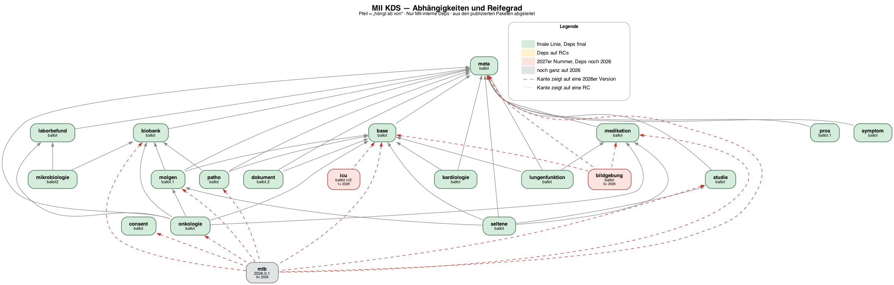

# Reifegrad der KDS-Module

BOM `2027.0.0-ballot.15` · 20 Module · automatisch erzeugt von `scripts/build-status.py`

Der Reifegrad misst **Version und Abhängigkeiten zusammen**. Eine 2027er Versionsnummer allein sagt wenig — entscheidend ist, worauf das Paket intern zeigt.

| Stufe | Module |
|---|---|
| **finale Linie** | base, biobank, consent, dokument, kardiologie, laborbefund, lungenfunktion, medikation, meta, mikrobiologie, molgen, onkologie, patho, pros, seltene, studie, symptom |
| **Nummer ohne Umzug** | bildgebung, icu |
| **noch 2026** | mtb |

**13 offene 2026er Referenzen** über alle Module.

## Je Modul

| Modul | Version | Deps | offen auf 2026 | auf RCs |
|---|---|---|---|---|
| mtb | `2026.0.1` | 9 | base, biobank, consent, medikation, meta, molgen, onkologie, patho, studie | — |
| bildgebung | `2027.0.0-ballot` | 3 | meta, base, medikation | — |
| icu | `2027.0.0-ballot.rc2` | 1 | base | — |
| base | `2027.0.0-ballot` | 1 | — | — |
| biobank | `2027.0.0-ballot` | 1 | — | — |
| consent | `2027.0.0-ballot` | 0 | — | — |
| dokument | `2027.0.0-ballot.2` | 2 | — | — |
| kardiologie | `2027.0.0-ballot` | 2 | — | — |
| laborbefund | `2027.0.0-ballot` | 1 | — | — |
| lungenfunktion | `2027.0.0-ballot` | 3 | — | — |
| medikation | `2027.0.0-ballot` | 1 | — | — |
| meta | `2027.0.0-ballot` | 0 | — | — |
| mikrobiologie | `2027.0.0-ballot2` | 2 | — | — |
| molgen | `2027.0.0-ballot.1` | 3 | — | — |
| onkologie | `2027.0.0-ballot` | 6 | — | — |
| patho | `2027.0.0-ballot` | 3 | — | — |
| pros | `2027.0.0-ballot.1` | 1 | — | — |
| seltene | `2027.0.0-ballot` | 5 | — | — |
| studie | `2027.0.0-ballot` | 1 | — | — |
| symptom | `2027.0.0-ballot` | 1 | — | — |

## Graph



Quelle: `dependency-graph.dot`. Neu rendern mit

```bash
./scripts/build-status.py
```
